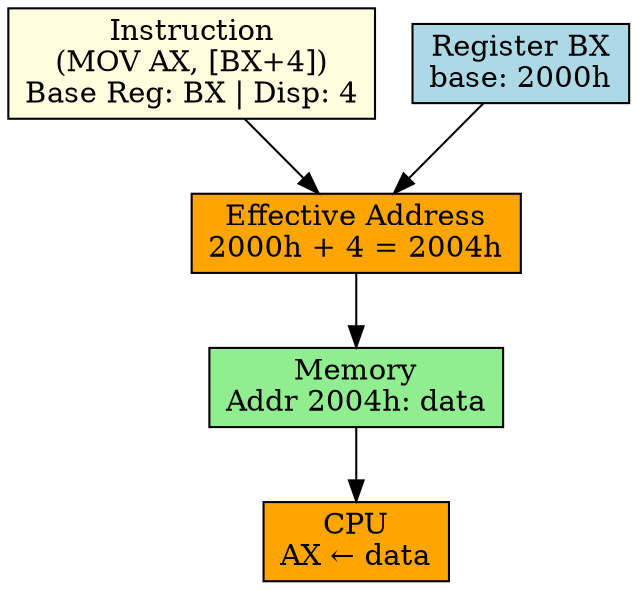

## The Problem
Structured data (structs, records) have fields at fixed offsets from a base pointer. Accessing `object.field` requires base address + field offset. Can addressing mode handle this?

## Core Idea
Register Indirect with Displacement computes the effective address by adding a register value (base) and a constant displacement (offset). Ideal for accessing structure fields and stack variables.

## How It Works
1. Instruction specifies a register (base) and a constant offset (displacement)
2. CPU reads the register to get base address
3. Effective address = register value + displacement
4. CPU accesses memory at computed address
5. Example: `MOV AX, [BX + 4]` — accesses memory at (BX + 4)

## Key Properties
- Perfect for struct/record field access: base = struct pointer, displacement = field offset
- Displacement is fixed at compile time (field offsets don't change)
- Used for stack variables (SP/BP + offset), struct fields, array elements
- More flexible than pure indirect or indexed addressing

## Connections
- **Built from:** [[addressing-mode|Addressing Mode]], [[indirect-addressing|Indirect Addressing]]
- **Related:** [[struct|Struct]], [[stack|Stack]], [[effective-address|Effective Address]]
- **Contrasts with:** [[indexed-addressing|Indexed Addressing]] — uses register for index, not constant
- **Builds into:** [[stack-frame|Stack Frame]] — accessing local variables

## Edge Cases & Gotchas
- Displacement is limited (typically 8 or 16 bits in instruction encoding)
- Register must contain valid base address
- Common in RISC: `lw $t0, 4($sp)` (MIPS load with displacement)

## Sources
- [[computer-architecture-summary|Computer Architecture Source Summary]]
