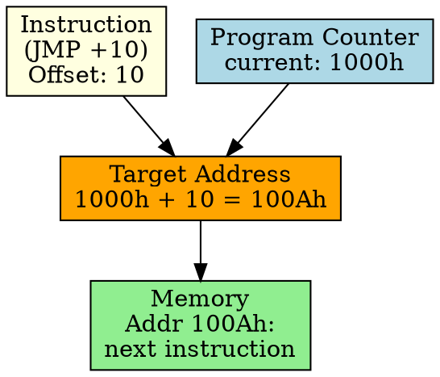

## The Problem
When writing code that might be loaded at different memory addresses (position-independent code), we can't use fixed addresses for jumps and branches. We need addresses relative to the current instruction.

## Core Idea
Relative Addressing computes the target address by adding an offset to the Program Counter (PC). The address is relative to the current instruction, making code position-independent.

## How It Works
1. Instruction specifies an offset value (positive or negative)
2. CPU reads current PC (address of current instruction)
3. Target address = PC + offset
4. Used primarily for branch and jump instructions
5. Example: `JMP 10` — jumps to address (PC + 10)

## Key Properties
- Position-independent: code works at any load address
- Offset is typically small (short jumps) or large (long jumps)
- Used for conditional/unconditional branches, function calls
- Most common addressing mode for control flow instructions

## Connections
- **Built from:** [[addressing-mode|Addressing Mode]], [[program-counter|Program Counter]]
- **Related:** [[branch-instruction|Branch Instruction]], [[jump-instruction|Jump Instruction]]
- **Contrasts with:** [[direct-addressing|Direct Addressing]] — fixed address, not relative
- **Builds into:** [[loop|Loop]], [[function-call|Function Call]]

## Edge Cases & Gotchas
- Offset range is limited (can't jump too far with short relative)
- PC value used is typically after instruction fetch (PC = next instruction)
- Negative offsets for backward jumps (loops)

## Sources
- [[computer-architecture-summary|Computer Architecture Source Summary]]
