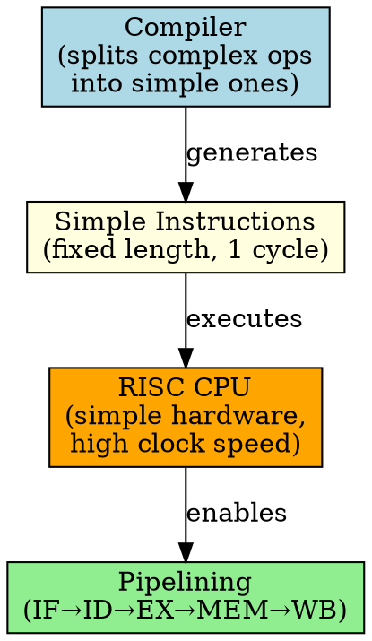

## The Problem
Complex instructions require complex hardware, making CPUs harder to design, slower to clock, and harder to pipeline. Can we simplify the instruction set to make CPUs faster and easier to build?

## Core Idea
RISC (Reduced Instruction Set Computer) uses a small, simple set of instructions where each instruction is designed to execute in one clock cycle, shifting complexity from hardware to software (compiler).

## How It Works
1. CPU has a small set of simple instructions (load, store, add, branch, etc.)
2. Each instruction is fixed-length, making decoding simple and fast
3. Complex operations are broken into multiple simple instructions by the compiler
4. Simple hardware enables pipelining — multiple instructions overlap in execution
5. CPU can run at higher clock speeds due to simpler logic

## Key Properties
- Small instruction set (typically 50-150 instructions)
- Fixed instruction length (easier decoding, simpler pipeline)
- One instruction per clock cycle (ideal, may vary in practice)
- High clock speeds possible due to simple hardware
- More instructions per program (compiler generates more instructions)

## Connections
- **Contrasts with:** [[cisc-architecture|CISC Architecture]] — complex instructions, hardware does more work
- **Built from:** [[cpu|CPU]], [[instruction-set|Instruction Set]], [[clock-cycle|Clock Cycle]]
- **Builds into:** [[pipelining|Pipelining]] — simple instructions enable easy pipelining
- **Related:** [[arm-architecture|ARM Architecture]], [[mips-architecture|MIPS Architecture]]

## Edge Cases & Gotchas
- Programs are larger (more instructions) than CISC equivalents
- More instructions means more memory bandwidth needed
- Not always faster — depends on compiler quality and workload
- Modern x86 CPUs translate CISC instructions to RISC-like micro-ops internally