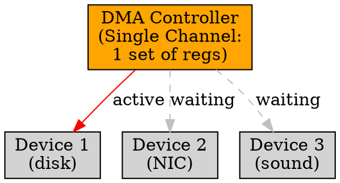

# Single-Channel DMA

## The Problem
Systems need to transfer data between multiple I/O devices and memory. A DMA controller that can only handle one device at a time creates a bottleneck when multiple devices need simultaneous transfers.

## Core Idea
Single-Channel DMA is a DMA configuration where only one DMA channel (and thus one device) can be active at a time — the DMA controller has a single set of address, count, and control registers.

## How It Works
1. CPU programs the single DMA channel with device, addresses, and count
2. DMA controller performs the transfer for that one device
3. When transfer completes, CPU can program the channel for a different device
4. Only one device can use DMA at any given time — others must wait or use Programmed I/O

## Key Properties
- Simple hardware — only one set of DMA registers needed
- Cheaper to implement than multi-channel DMA
- Creates bottleneck when multiple devices need DMA simultaneously
- Common in early or low-cost systems

## Connections
- **Built from:** [[dma|DMA]], [[dma-controller|DMA Controller]]
- **Contrasts with:** [[multi-channel-dma|Multi-Channel DMA]] — multiple devices can use DMA concurrently
- **Related:** [[io-devices|I/O Devices]], [[device-controller|Device Controller]]
- **Builds into:** [[buffering|Buffering]] — can help mitigate single-channel limitation

## Edge Cases & Gotchas
- Device starvation: high-priority device may wait long if low-priority device is using DMA
- No concurrent DMA transfers — can't overlap disk read with network packet send
- Some single-channel DMACs support "chaining" — auto-program next transfer after current one

## Sources
- [[computer-architecture-summary|Computer Architecture Source Summary]]
