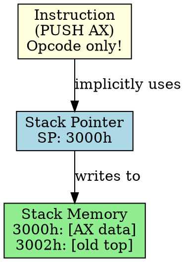

# Stack Addressing

## The Problem
Function calls need to pass parameters and save return addresses. Managing this manually is error-prone. Can we use a dedicated memory structure (stack) with implicit addressing?

## Core Idea
Stack Addressing uses the top of the stack as the operand location. Instructions like PUSH and POP operate on the stack top, with the stack pointer (SP) implicitly specifying the address — no explicit address needed in the instruction.

## How It Works
1. Stack pointer (SP) register points to top of stack
2. PUSH instruction: decrement SP, write data to address in SP
3. POP instruction: read data from address in SP, increment SP
4. Example: `PUSH AX` — pushes AX onto stack; `POP BX` — pops top of stack into BX
5. Stack grows downward (typically) or upward, depending on architecture

## Key Properties
- No address in instruction (implicit addressing) — instructions are short
- Used for function calls (saving return address), local variables, expression evaluation
- Stack pointer automatically updated — easy to use
- LIFO order: last pushed = first popped

## Connections
- **Built from:** [[addressing-mode|Addressing Mode]], [[stack|Stack]], [[stack-pointer|Stack Pointer]]
- **Related:** [[function-call|Function Call]], [[push-instruction|PUSH Instruction]], [[pop-instruction|POP Instruction]]
- **Builds into:** [[stack-frame|Stack Frame]], [[function-parameters|Function Parameters]]
- **Contrasts with:** [[direct-addressing|Direct Addressing]] — explicit address needed

## Edge Cases & Gotchas
- Stack overflow: pushing too much data exceeds stack size
- Stack underflow: popping when stack is empty
- Stack grows toward other memory — must manage stack size carefully

## Sources
- [[computer-architecture-summary|Computer Architecture Source Summary]]
