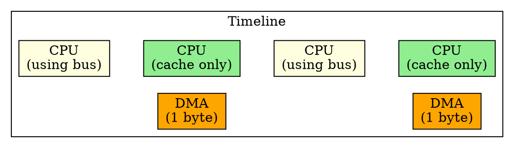

# Transparent Mode DMA

## The Problem
Even Cycle Stealing Mode can interrupt CPU work. For systems where CPU responsiveness is critical and DMA transfers are large, we need a mode where DMA is truly "transparent" to the CPU — no interference at all.

## Core Idea
Transparent Mode DMA only transfers data when the CPU is not using the system bus, making the DMA operation completely invisible to the CPU with zero performance impact.

## How It Works
1. DMA controller monitors CPU bus usage
2. When CPU is not accessing memory (e.g., executing from cache, doing register-only ops), DMA transfers one byte/word
3. If CPU needs the bus, DMA immediately releases it
4. DMA resumes when bus becomes free again
5. Transfer continues opportunistically until complete

## Key Properties
- Slowest DMA mode (limited by CPU idle bus time)
- Zero CPU overhead — completely transparent to CPU
- Most complex to implement (needs bus monitoring logic)
- Best for background transfers where speed doesn't matter but CPU responsiveness does

## Connections
- **Built from:** [[dma|DMA]], [[dma-controller|DMA Controller]]
- **Contrasts with:** [[burst-mode-dma|Burst Mode DMA]] — CPU fully blocked, fastest transfer
- **Contrasts with:** [[cycle-stealing-mode-dma|Cycle Stealing Mode DMA]] — CPU can work between transfers, but still interrupted
- **Related:** [[cpu|CPU]], [[system-bus|System Bus]]

## Edge Cases & Gotchas
- Very slow for large transfers if CPU is constantly busy with memory accesses
- Complex hardware required to monitor bus usage and arbitrate fairly
- Not suitable for time-critical transfers (no guaranteed completion time)
- May never complete if CPU never releases bus (starvation)

## Sources
- [[computer-architecture-summary|Computer Architecture Source Summary]]
