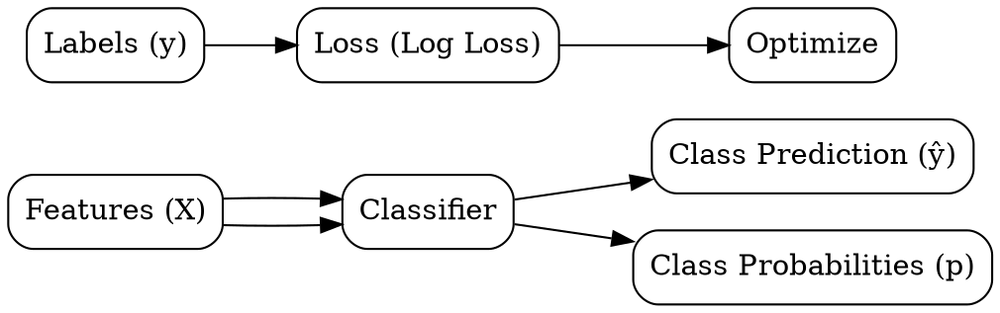

## The Problem
We need to predict which category or class an observation belongs to (spam/not-spam, cat/dog, disease/no-disease).

## Core Idea
Supervised learning task where the goal is to predict a discrete categorical label from input features.

## How It Works
1. Collect labeled data: features X and categorical labels y (e.g., 0/1, cat/dog)
2. Choose classifier: logistic regression, decision trees, SVM, neural networks, etc.
3. Define loss function: log loss, hinge loss, or misclassification rate
4. Train: find model parameters that minimize classification error
5. Predict: for new inputs, output class label or probability distribution

## Visual Explanation

## Key Properties
- Discrete output: predicts categories or class membership probabilities
- Probabilistic or deterministic: can output "most likely class" or full probability distribution
- Imbalanced: rare classes are harder to learn (may need special techniques)
- Metrics: accuracy, precision, recall, F1-score, AUC-ROC (not just "error rate")

## Connections
- Built from: [[supervised-learning|Supervised Learning]] — classification is a supervised task
- Contrasts with: [[regression|Regression]] — predicts categories instead of continuous numbers
- Built from: [[decision-tree-structure|Decision Tree Structure]] — trees solve classification via leaf class labels
- Related: [[decision-tree-prediction|Decision Tree Prediction]] — trees classify by root-to-leaf traversal
- Related: [[train-test-split|Train-Test Split]] — classification needs stratified splitting
- Related: [[overfitting|Overfitting]] — classifiers can memorize training examples

## Edge Cases & Gotchas
- Class imbalance: accuracy is misleading when 95% of examples are one class
- Threshold choice: default 0.5 may not be optimal for asymmetric costs
- Multiclass vs multilabel: one example can belong to multiple categories (different problem)
- Calibration: predicted probabilities may not match true probabilities

## Sources
- [[ds-summary|Data Science Book Summary]]
- [[dtree-summary|Decision Tree in Machine Learning]] — classification via decision tree leaf nodes
