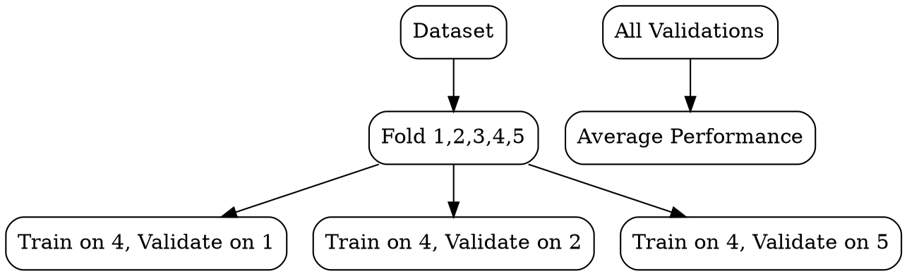

# Cross-Validation

## The Problem
A single train-test split gives a noisy estimate of model performance — different splits give different results, especially on small datasets.

## Core Idea
A resampling technique that repeatedly splits data into train and validation sets to get a more robust estimate of model performance.

## How It Works
1. Choose k (typically 5 or 10)
2. Split data into k roughly equal folds
3. For each fold i: train on all folds except i, validate on fold i
4. Compute performance metric for each fold
5. Average the k performance scores for final estimate

## Visual Explanation

## Key Properties
- Robust: reduces variance of performance estimate compared to single split
- Computationally expensive: requires training k models instead of one
- Data-efficient: uses all data for both training and validation (just not simultaneously)
- Standard: the gold standard for model evaluation in ML research

## Connections
- Built from: [[train-test-split|Train-Test Split]] — cross-validation is a multi-split extension
- Related: [[overfitting|Overfitting]] — CV helps detect overfitting more reliably
- Related: [[supervised-learning|Supervised Learning]] — CV is used to evaluate supervised models
- Related: [[data-modeling|Data Modeling]] — model selection uses CV to compare algorithms

## Edge Cases & Gotchas
- Time series data: standard k-fold breaks temporal ordering (use time-series CV)
- Data leakage: preprocessing (normalization) must be done inside each fold
- Stratification: for classification, ensure each fold has representative class proportions
- Small datasets: leave-one-out CV (k=n) can have high variance despite being "exact"

## Sources
- [[ds-summary|Data Science Book Summary]]
