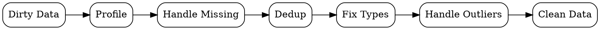

## The Problem
Real-world data contains missing values, duplicates, outliers, and incorrect types that break analysis and models.

## Core Idea
Identifying and fixing errors, inconsistencies, and missing values in a dataset to make it suitable for analysis.

## How It Works
1. Profile data: summarize columns, check types, identify missing values
2. Handle missing data: drop, impute with mean/median/mode, or model-based imputation
3. Remove duplicates: identify and eliminate repeated records
4. Fix data types: convert strings to dates, numbers, or categories
5. Handle outliers: cap, transform, or remove extreme values

## Visual Explanation

## Key Properties
- Dataset-specific: cleaning steps vary by domain and data source
- Trade-off: aggressive cleaning vs preserving information
- Documentation-critical: every cleaning decision must be recorded
- Statistical: often requires understanding distributions to identify issues

## Connections
- Built from: [[data-wrangling|Data Wrangling]] — cleaning is a phase within wrangling
- Builds into: [[data-transformation|Data Transformation]] — clean data is ready for reshaping
- Related: [[exploratory-data-analysis|EDA]] — profiling reveals what needs cleaning
- Related: [[feature-engineering|Feature Engineering]] — clean features enable better models

## Edge Cases & Gotchas
- Blindly dropping all missing values can bias results
- Mean imputation distorts variance and correlations
- Automated duplicate detection may miss fuzzy duplicates
- Over-aggressive outlier removal eliminates rare but important events