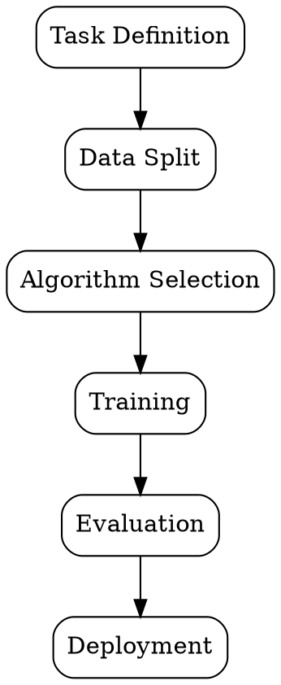

# Data Modeling

## The Problem
Organizations need to make predictions, classify objects, or discover patterns — tasks that require mathematical models trained on data.

## Core Idea
The process of selecting, training, and evaluating machine learning algorithms to make predictions or discover patterns in data.

## How It Works
1. Define the task: regression (predict number), classification (predict category), or clustering (find groups)
2. Split data: training set (learn patterns), validation set (tune), test set (evaluate)
3. Select algorithms: choose models appropriate for the task and data size
4. Train models: fit algorithms to training data by minimizing a loss function
5. Evaluate: assess performance using appropriate metrics (RMSE, accuracy, F1)

## Visual Explanation

## Key Properties
- Task-dependent: different problems require different model types
- Data-hungry: more data usually improves performance (up to a point)
- Non-convex: many models have multiple local optima during training
- Stochastic: same model with different random seeds can produce different results

## Connections
- Built from: [[feature-engineering|Feature Engineering]] — models need engineered features
- Builds into: [[supervised-learning|Supervised Learning]] — modeling approach for labeled data
- Builds into: [[unsupervised-learning|Unsupervised Learning]] — modeling approach for unlabeled data
- Related: [[data-science|Data Science]] — modeling is the core of data science

## Edge Cases & Gotchas
- Overfitting: model memorizes training data, fails on new data
- Underfitting: model is too simple to capture underlying patterns
- Data leakage: information from test set inadvertently used during training
- Ignoring model assumptions: linear models assume linear relationships

## Sources
- [[ds-summary|Data Science Book Summary]]
