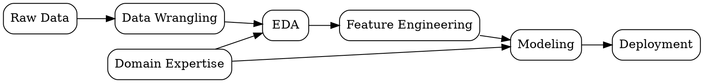

# Data Science

## The Problem
Organizations collect massive amounts of raw data but lack methods to extract actionable insights, predict trends, or automate decisions from it.

## Core Idea
Interdisciplinary field combining statistics, programming, and domain expertise to extract knowledge and insights from structured and unstructured data.

## How It Works
1. Data collection from diverse sources (databases, APIs, sensors)
2. Data wrangling to clean and transform raw data into usable format
3. Exploratory data analysis to understand patterns and relationships
4. Feature engineering to create predictive variables
5. Model training and evaluation to build predictive systems
6. Deployment and monitoring of models in production

## Visual Explanation

## Key Properties
- Interdisciplinary: combines statistics, computer science, and domain knowledge
- End-to-end: covers full pipeline from raw data to production insights
- Iterative: requires constant refinement of models and features
- Data-driven: relies on empirical evidence rather than assumptions

## Connections
- Built from: [[data-wrangling|Data Wrangling]] — foundational step for all data science work
- Builds into: [[data-modeling|Data Modeling]] — core output of data science pipelines
- Related: [[exploratory-data-analysis|EDA]] — critical exploratory phase
- Related: [[feature-engineering|Feature Engineering]] — key preparatory step for modeling

## Edge Cases & Gotchas
- Confusing correlation with causation in insights
- Overfitting models to training data
- Ignoring domain expertise in favor of pure technical approaches
- Neglecting data quality issues in raw sources

## Sources
- [[ds-summary|Data Science Book Summary]]
