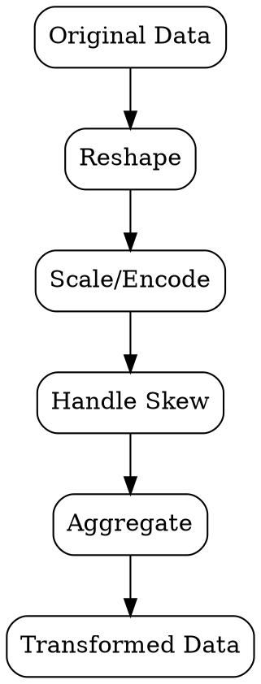
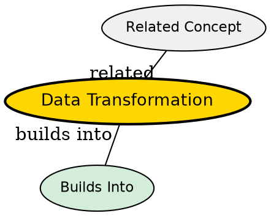

## The Problem
Data is often in the wrong shape, scale, or format for the intended analysis or model algorithm.

## Core Idea
Converting data from one format, structure, or scale to another to make it suitable for analysis and modeling.

## How It Works
1. Reshaping: pivot, melt, or cast data between wide and long formats
2. Scaling: normalize (0-1) or standardize (mean=0, std=1) numeric features
3. Encoding: convert categorical variables to numeric (one-hot, label encoding)
4. Log/power transforms: handle skewed distributions
5. Aggregation: group by dimensions and compute summary statistics

## Visual Explanation

## Key Properties
- Algorithm-dependent: some models require specific data shapes or scales
- Information-preserving: good transforms maintain relationships in data
- Reversible: many transforms can be undone (important for interpretability)
- Standardization: consistent transforms across train and test sets

## Semantic Network

## Connections
- Built from: [[data-cleaning|Data Cleaning]] -- clean data is prerequisite
- Builds into: [[feature-engineering|Feature Engineering]] -- transformed features become inputs
- Related: [[data-wrangling|Data Wrangling]] -- transformation is a wrangling step
- Related: [[exploratory-data-analysis|EDA]] -- transforms often inspired by EDA findings

## Edge Cases & Gotchas
- Applying different transforms to train vs test sets causes data leakage
- One-hot encoding high-cardinality categoricals creates dimensionality explosion
- Standardization before train/test split causes information leakage
- Log transforms fail on zero or negative values without adjustment