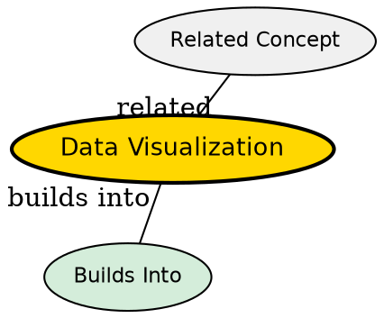

## The Problem
Tables of numbers are incomprehensible at scale -- humans cannot intuitively grasp patterns, trends, or outliers from raw data.

## Core Idea
Representing data graphically to enable pattern recognition, comparison, and communication of insights.

## How It Works
1. Select chart type based on data and message (bar, line, scatter, heatmap)
2. Map data variables to visual channels (x, y, color, size, shape)
3. Apply design principles: minimize clutter, highlight key findings
4. Iterate: refine based on what the audience needs to understand
5. Communicate: use visualizations to tell a data-driven story

## Visual Explanation

## Key Properties
- Channel-effectiveness: some visual channels (position) are better than others (color)
- Audience-dependent: different charts for technical vs non-technical audiences
- Purpose-driven: exploratory (many charts, quick) vs explanatory (few charts, polished)
- Truth-telling: visualizations must accurately represent the underlying data

## Semantic Network

## Connections
- Built from: [[exploratory-data-analysis|EDA]] -- visualization is EDA's primary tool
- Builds into: [[data-science|Data Science]] -- communication is the final step
- Related: [[feature-engineering|Feature Engineering]] -- visualizations reveal feature relationships
- Related: [[data-wrangling|Data Wrangling]] -- visualize data quality issues

## Edge Cases & Gotchas
- Misleading axes (non-zero baselines, truncated ranges) distort perception
- Over-plotting in scatter plots hides density and patterns
- Color blindness: red-green comparisons are inaccessible
- Chart junk: unnecessary decorations distract from the data