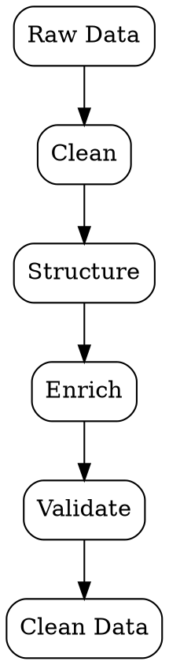
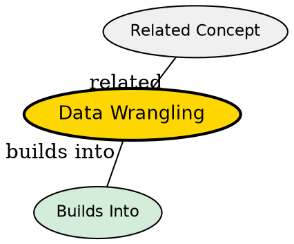

## The Problem
Raw data is messy, incomplete, and unstructured -- unusable for analysis or modeling without significant preprocessing.

## Core Idea
The process of cleaning, structuring, and enriching raw data into a usable format for analysis and modeling.

## How It Works
1. Data collection from disparate sources (CSV, APIs, databases)
2. Cleaning: handling missing values, removing duplicates, fixing types
3. Structuring: reshaping data into tidy format (rows=observations, columns=variables)
4. Enriching: joining datasets, creating derived features
5. Validating: ensuring data integrity before analysis

## Visual Explanation

## Key Properties
- Time-consuming: often 60-80% of data science work
- Iterative: multiple passes may be needed
- Source-dependent: each data source has unique quality issues
- Foundation: poor wrangling corrupts all downstream analysis

## Semantic Network

## Connections
- Built from: [[data-science|Data Science]] -- core component of the field
- Builds into: [[exploratory-data-analysis|EDA]] -- clean data enables exploration
- Related: [[data-cleaning|Data Cleaning]] -- subset focused on fixing errors
- Related: [[data-transformation|Data Transformation]] -- reshaping and converting data

## Edge Cases & Gotchas
- Over-cleaning can remove meaningful outliers
- Inconsistent cleaning across train/test sets causes leakage
- Assuming data types without validation (e.g., numeric IDs as integers)
- Not documenting wrangling steps for reproducibility