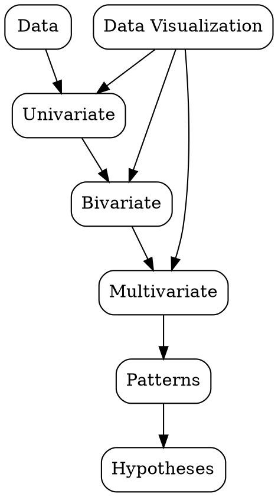

## The Problem
Without understanding data distributions, relationships, and patterns, any modeling approach is essentially guessing.

## Core Idea
An iterative process of summarizing, visualizing, and understanding data to formulate hypotheses and guide modeling decisions.

## How It Works
1. Univariate analysis: examine each variable's distribution (histograms, box plots)
2. Bivariate analysis: explore relationships between pairs of variables (scatter plots, correlation)
3. Multivariate analysis: examine interactions between multiple variables
4. Identify patterns: trends, seasonality, clusters, or anomalies
5. Formulate hypotheses: guide feature engineering and model selection

## Visual Explanation

## Key Properties
- Hypothesis-generating: not for testing, but for discovering what to test
- Visual-first: human pattern recognition outperforms automated methods
- Iterative: findings lead to new questions and deeper exploration
- Open-ended: no fixed endpoint, driven by curiosity and domain knowledge

## Connections
- Built from: [[data-wrangling|Data Wrangling]] — EDA requires clean, structured data
- Builds into: [[feature-engineering|Feature Engineering]] — EDA insights drive feature creation
- Related: [[data-visualization|Data Visualization]] — EDA relies heavily on visualization
- Related: [[data-science|Data Science]] — EDA is a core phase of the data science process

## Edge Cases & Gotchas
- Confirmation bias: seeing patterns that confirm pre-existing beliefs
- Over-interpreting random noise as meaningful patterns
- Not adjusting for multiple comparisons when exploring many relationships
- Ignoring data quality issues that distort EDA findings