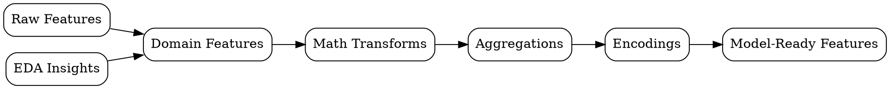

## The Problem
Raw data rarely comes in a format that machine learning algorithms can use effectively — models are only as good as their inputs.

## Core Idea
Creating new input variables (features) from raw data that make machine learning algorithms work better.

## How It Works
1. Domain knowledge: create features based on expert understanding of the problem
2. Mathematical transforms: polynomials, interactions, logarithms of existing features
3. Aggregations: rolling windows, group-by statistics, time-based features
4. Encodings: target encoding, frequency encoding, embedding representations
5. Selection: keep only features that improve model performance

## Visual Explanation

## Key Properties
- Model-critical: often more impactful than algorithm choice
- Domain-dependent: best features require understanding the problem context
- Creative: no fixed recipe, requires experimentation and intuition
- Computationally-expensive: complex features can slow training significantly

## Connections
- Built from: [[exploratory-data-analysis|EDA]] — EDA reveals what features to create
- Builds into: [[data-modeling|Data Modeling]] — engineered features are model inputs
- Related: [[data-transformation|Data Transformation]] — transformation is a type of feature engineering
- Related: [[data-science|Data Science]] — feature engineering bridges data and models

## Edge Cases & Gotchas
- Data leakage: creating features from test set information during training
- Overfitting: engineering too many features for small datasets
- Feature importance illusion: correlated features distort importance rankings
- Ignoring feature stability: features that change meaning over time