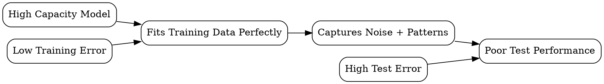

## The Problem
Models that perform perfectly on training data but fail on new data are useless in practice — they've memorized noise instead of learning patterns.

## Core Idea
When a model learns training data too well, including noise and idiosyncrasies, resulting in poor generalization to new data.

## How It Works
1. Model has high capacity (too many parameters relative to data)
2. Trains to minimize training error, reaching near-zero training loss
3. Model captures noise, outliers, and sampling artifacts as "patterns"
4. On test data, these spurious patterns don't generalize
5. Gap between training and test performance becomes large

## Visual Explanation

## Key Properties
- Capacity-driven: more parameters + less data = higher overfitting risk
- Detectable: large train-test performance gap is the signature
- Reducible: regularization, more data, or simpler models can fix it
- Universal: affects all machine learning models to some degree

## Connections
- Built from: [[train-test-split|Train-Test Split]] — the tool to detect overfitting
- Contrasts with: [[underfitting|Underfitting]] — opposite problem (model too simple)
- Related: [[supervised-learning|Supervised Learning]] — overfitting is a supervised learning risk
- Related: [[cross-validation|Cross-Validation]] — helps detect and mitigate overfitting

## Edge Cases & Gotchas
- Overfitting can happen even with simple models on very small datasets
- Data augmentation and regularization can mask underlying overfitting
- Validation set overfitting: tuning hyperparameters too aggressively on validation set
- Multiple comparison problem: testing many models increases chance of "significant" overfitting

## Sources
- [[ds-summary|Data Science Book Summary]]
