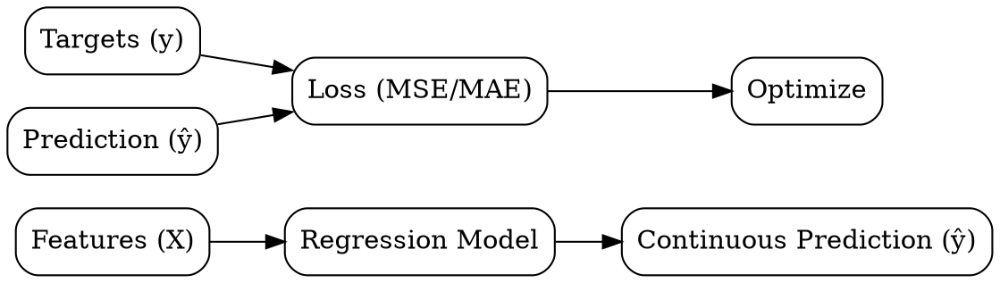

## The Problem
We need to predict a continuous numeric value (price, temperature, probability) but the relationship between inputs and output is complex.

## Core Idea
Supervised learning task where the goal is to predict a continuous numeric output variable from input features.

## How It Works
1. Collect labeled data: features X and continuous target y
2. Choose regression model: linear regression, decision trees, neural networks, etc.
3. Define loss function: typically mean squared error (MSE) or mean absolute error (MAE)
4. Train: find model parameters that minimize average prediction error
5. Predict: for new inputs, compute continuous output value

## Visual Explanation

## Key Properties
- Continuous output: predicts values on a real-valued scale (not categories)
- Probabilistic: can model uncertainty via prediction intervals
- Interpretable: linear regression coefficients show feature importance directly
- Metric-dependent: MSE penalizes large errors more than MAE

## Connections
- Built from: [[supervised-learning|Supervised Learning]] — regression is a supervised task
- Contrasts with: [[classification|Classification]] — predicts categories instead of numbers
- Built from: [[decision-tree-structure|Decision Tree Structure]] — trees solve regression via leaf mean values
- Related: [[decision-tree-flexibility|Decision Tree Flexibility]] — trees handle both classification and regression
- Related: [[train-test-split|Train-Test Split]] — regression models need held-out evaluation
- Related: [[overfitting|Overfitting]] — regression models can overfit with too many features

## Edge Cases & Gotchas
- Heteroscedasticity: error variance changes with input values (violates OLS assumptions)
- Multicollinearity: correlated features distort coefficient estimates
- Outliers: heavily influence linear regression (consider robust regression)
- Non-linearity: linear regression fails when true relationship is curved

## Sources
- [[ds-summary|Data Science Book Summary]]
- [[dtree-summary|Decision Tree in Machine Learning]] — regression via decision tree leaf mean values
