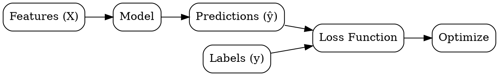

## The Problem
We need to predict an output variable (price, category, probability) given input features, but the relationship is too complex to code manually.

## Core Idea
Machine learning paradigm where models learn a mapping from input features to output labels using labeled training examples.

## How It Works
1. Collect labeled data: input features X and correct output labels y
2. Choose model family: decision trees, linear models, neural networks, etc.
3. Define loss function: measure prediction error (MSE for regression, cross-entropy for classification, impurity for trees)
4. Optimize: adjust model parameters to minimize loss on training data
5. Validate: assess generalization to unseen data

**Decision trees** use a different approach: instead of optimizing parameters, they recursively partition the data using attribute tests (Information Gain or Gini Index) until pure subsets are reached. This makes them interpretable but prone to overfitting without pruning.

## Visual Explanation

## Key Properties
- Labeled data required: need ground truth for every training example
- Generalization goal: minimize error on unseen data, not just training data
- Bias-variance tradeoff: simpler models have high bias, complex models have high variance
- Inductive: learns specific-to-general mapping from examples

## Connections
- Built from: [[data-modeling|Data Modeling]] — supervised learning is a modeling approach
- Builds into: [[regression|Regression]] — supervised task for continuous outputs
- Builds into: [[classification|Classification]] — supervised task for categorical outputs
- Builds into: [[decision-tree-structure|Decision Tree Structure]] — trees are a supervised algorithm
- Builds into: [[id3-algorithm|ID3 Algorithm]] — foundational decision tree construction method
- Related: [[train-test-split|Train-Test Split]] — supervised learning requires careful data splitting
- Related: [[decision-tree-interpretability|Decision Tree Interpretability]] — trees offer inherent explainability

## Edge Cases & Gotchas
- Label noise: incorrect labels mislead the model
- Class imbalance: rare classes get ignored by models optimizing overall accuracy
- Concept drift: relationship between X and y changes over time
- Covariate shift: training and test data have different feature distributions

## Sources
- [[ds-summary|Data Science Book Summary]]
- [[dtree-summary|Decision Tree in Machine Learning]] — decision trees as a supervised algorithm family
