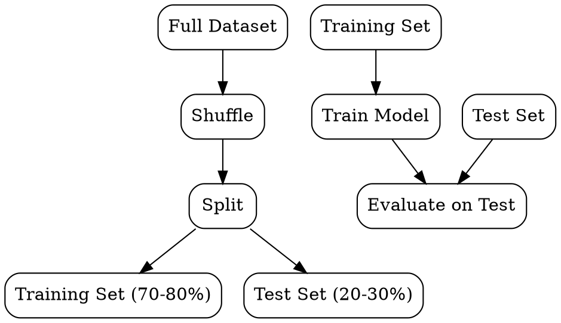

## The Problem
Models can memorize training data and appear perfect, but fail on new data — we need a way to estimate real-world performance.

## Core Idea
Dividing a dataset into separate subsets for training (learning parameters) and testing (evaluating generalization) to detect overfitting.

## How It Works
1. Randomly shuffle data to remove ordering effects
2. Split: typically 70-80% train, 20-30% test (or 60-20-20 train-val-test)
3. Train model exclusively on training set
4. Evaluate model exclusively on test set (never seen during training)
5. Use test performance as estimate of real-world performance

## Visual Explanation

## Key Properties
- Generalization estimate: test performance approximates real-world performance
- Independence: test set must never influence training (no leakage)
- Randomness: different splits give different performance estimates
- Stratification: preserve class proportions in classification tasks

## Connections
- Built from: [[supervised-learning|Supervised Learning]] — split is fundamental to supervised training
- Related: [[cross-validation|Cross-Validation]] — more robust alternative to single split
- Related: [[overfitting|Overfitting]] — train-test split detects overfitting
- Related: [[data-modeling|Data Modeling]] — splitting is a modeling prerequisite

## Edge Cases & Gotchas
- Data leakage: information from test set inadvertently used during training
- Small datasets: single split gives high-variance performance estimates
- Non-IID data: time series or clustered data require special splitting strategies
- Test set overfitting: tuning hyperparameters on test set invalidates the estimate