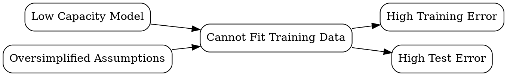

# Underfitting

## The Problem
Models that are too simple cannot capture the underlying patterns in data, performing poorly on both training and test data.

## Core Idea
When a model is not complex enough to capture the true patterns in the data, resulting in poor performance everywhere.

## How It Works
1. Model has low capacity (too few parameters or overly restrictive assumptions)
2. Training error remains high because model cannot fit the data
3. Test error is also high (if model can't fit training, it can't generalize either)
4. Model makes simplistic assumptions (linear when relationship is nonlinear)
5. Both train and test performance are similarly poor

## Visual Explanation

## Key Properties
- Capacity-driven: fewer parameters + complex data = higher underfitting risk
- Detectable: poor training performance is the signature
- Fixable: more complex models, more features, or less regularization
- Symmetric: opposite of overfitting (train-test gap is small, but both are bad)

## Connections
- Contrasts with: [[overfitting|Overfitting]] — opposite problem (model too complex)
- Related: [[supervised-learning|Supervised Learning]] — underfitting affects all supervised models
- Related: [[train-test-split|Train-Test Split]] — both train and test errors reveal underfitting
- Related: [[data-modeling|Data Modeling]] — model selection must balance under/over-fitting

## Edge Cases & Gotchas
- Underfitting can masquerade as overfitting if only test error is monitored
- Excessive regularization (L1/L2 penalty too high) causes underfitting
- Feature scaling issues can make models appear to underfit
- Wrong model family: linear model for highly nonlinear data

## Sources
- [[ds-summary|Data Science Book Summary]]
