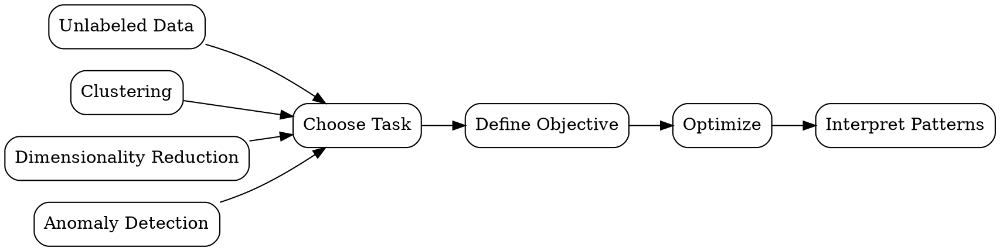

# Unsupervised Learning

## The Problem
We have data but no labels — we need to discover hidden structure, groups, or patterns without guidance on what to look for.

## Core Idea
Machine learning paradigm where models find patterns, structure, or reduced representations in unlabeled data.

## How It Works
1. Collect unlabeled data: only input features X, no output labels
2. Choose task: clustering (find groups), dimensionality reduction (compress), or anomaly detection
3. Define objective: minimize reconstruction error, maximize cluster separation, etc.
4. Optimize: adjust model to best achieve the objective on data
5. Interpret: examine discovered patterns for meaning and utility

## Visual Explanation

## Key Properties
- No labels needed: works with raw, unlabeled datasets
- Subjective: "good" patterns depend on the application and interpretation
- Exploratory: reveals what might be interesting, not what is definitively true
- Preprocessing: often used as a step before supervised learning

## Connections
- Built from: [[data-modeling|Data Modeling]] — unsupervised learning is a modeling approach
- Related: [[supervised-learning|Supervised Learning]] — contrast in label requirements
- Related: [[exploratory-data-analysis|EDA]] — both are exploratory, discovery-oriented
- Related: [[feature-engineering|Feature Engineering]] — dimensionality reduction creates new features

## Edge Cases & Gotchas
- No ground truth: cannot compute accuracy or error rate on unseen data
- Cluster interpretation: assigning meaning to clusters is subjective
- Initialization sensitivity: many algorithms (k-means) depend on random starts
- Curse of dimensionality: distance-based methods fail in high-dimensional spaces

## Sources
- [[ds-summary|Data Science Book Summary]]
