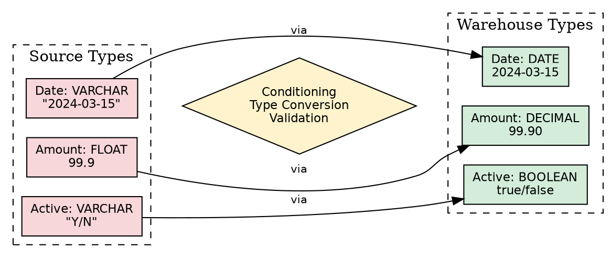
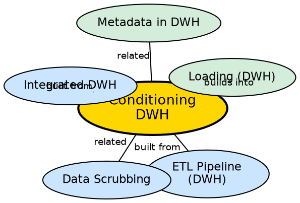

## The Problem

Different source systems use different data types to represent the same concept. One system stores a date as a VARCHAR string "2024-03-15", another as an integer 20240315, and another as a DATE object. One system stores monetary values as DECIMAL(10,2), another as FLOAT (losing precision), and another as VARCHAR with currency symbols. When these values are loaded into the warehouse without type conversion, queries fail or produce incorrect results.

## Core Idea

**Conditioning** is the process of converting data types from the source system's representation to the target data warehouse's expected types. It ensures that every column in the warehouse has a consistent, well-defined data type, enabling correct comparisons, aggregations, and joins.

## How It Works

Conditioning operates on individual columns during the ETL transformation phase:

1. **Identify type mismatches:** Compare source column types against the warehouse schema definition.
2. **Apply type conversions:**
   - String to date: "2024-03-15" (VARCHAR) → 2024-03-15 (DATE)
   - String to integer: "42" (VARCHAR) → 42 (INT)
   - Float to decimal: 99.9 (FLOAT, imprecise) → 99.90 (DECIMAL(10,2), precise)
   - String to boolean: "Y/N", "1/0", "True/False" → BOOLEAN
3. **Handle conversion failures:** Records that cannot be converted (e.g., "abc" to integer) are flagged as errors and routed to an exception table.
4. **Apply default values:** For nullable columns with missing data, apply warehouse-defined defaults (e.g., NULL → 0 for numeric, NULL → empty string for text).
5. **Validate constraints:** After conversion, check that values fall within expected ranges (e.g., age between 0 and 150, date not in the future).

Conditioning is distinct from scrubbing: scrubbing standardizes **values** (e.g., "M" vs "Male"), while conditioning standardizes **types** (e.g., VARCHAR → DATE).

## Visual Explanation

## Semantic Network

## Key Properties

- **Type conversion:** Maps source data types to warehouse target types
- **Precision preservation:** Converts imprecise types (FLOAT) to precise types (DECIMAL) for monetary values
- **Error handling:** Failed conversions are flagged, not silently ignored
- **Constraint validation:** Post-conversion checks ensure data integrity
- **Distinct from scrubbing:** Conditioning handles types; scrubbing handles values

## Connections

- **Built from:** [[etl-pipeline-dwh|ETL Pipeline (DWH)]] — conditioning is part of the Transform phase
- **Built from:** [[integrated-dwh|Integrated DWH]] — type consistency is required for integration
- **Related:** [[data-scrubbing|Data Scrubbing]] — conditioning complements scrubbing (types vs. values)
- **Builds into:** [[loading-dwh|Loading (DWH)]] — conditioned data is ready for loading
- **Related:** [[metadata-in-dwh|Metadata in DWH]] — warehouse schema (target types) is defined in metadata

## Edge Cases & Gotchas

- **Precision loss:** Converting DECIMAL to FLOAT loses precision. Always convert toward more precise types.
- **Date format ambiguity:** "03/04/2024" could be March 4 or April 3. The warehouse must enforce a canonical date format.
- **Overflow:** Converting a large integer to a smaller type (e.g., BIGINT to INT) can cause overflow errors.
- **Null handling:** Some source types have no equivalent null value (e.g., primitive types). The warehouse must decide on sentinel values.

## Sources

- [[dw1-summary|Source: Data Warehouse — Definitions, Architecture, ETL, OLAP]] — conditioning as transformation sub-process
