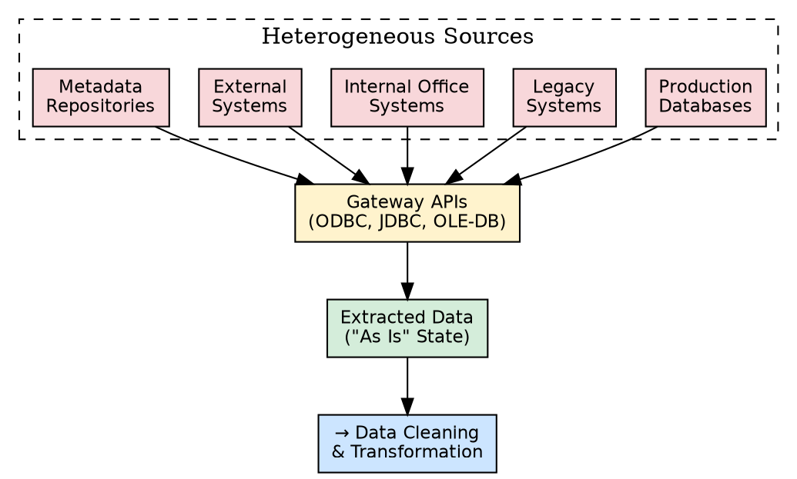
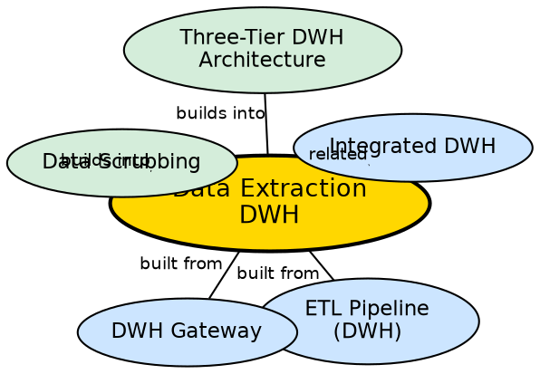

## The Problem

A company's data is scattered across production databases, legacy mainframe systems, internal office tools, external consultant reports, and metadata repositories. Each source has its own format, access protocol, and data model. Before any analysis can happen, this scattered data must be gathered and brought into a single pipeline for processing.

## Core Idea

**Data extraction** is the first phase of the ETL pipeline. It involves gathering raw data from multiple heterogeneous sources — production databases, legacy systems, internal office systems, external systems, and metadata — and capturing it in its **"as is"** state without any modification. Extraction is the foundation upon which all subsequent cleaning, transformation, and loading depend.

## How It Works

The extraction process targets five categories of data sources:

1. **Production databases:** The live operational systems (OLTP) where daily business transactions are recorded — sales records, customer registrations, inventory updates.
2. **Legacy data:** Older systems that may use outdated formats or protocols but still contain valuable historical data. These often require specialized gateways or adapters.
3. **Internal office systems:** Department-level systems like HR databases, project management tools, and internal reporting systems.
4. **External systems:** Data from outside the organization — market research reports, demographic data, partner data, consultant-provided profiles.
5. **Metadata:** Data about the structure, origin, and meaning of the other data sources — schema definitions, data dictionaries, and transformation rules.

Extraction uses **gateways** (ODBC, JDBC, OLE-DB) to establish connections to each source and pull data through standardized API calls. The extracted data is captured without modification — it is the raw input that will be cleaned and transformed in the next ETL phase.

## Visual Explanation

## Semantic Network

## Key Properties

- **"As is" capture:** Data is extracted without modification — cleaning happens in the next phase
- **Five source categories:** Production, legacy, office, external, metadata
- **Gateway-dependent:** Uses ODBC, JDBC, OLE-DB for uniform access to heterogeneous sources
- **First ETL phase:** Foundation of the entire pipeline — garbage extraction produces garbage analysis
- **Volume awareness:** Must handle large data volumes efficiently to avoid impacting source systems

## Connections

- **Built from:** [[etl-pipeline-dwh|ETL Pipeline (DWH)]] — extraction is the first phase
- **Built from:** [[dwh-gateway|DWH Gateway]] — gateways provide the technical extraction mechanism
- **Builds into:** [[data-scrubbing|Data Scrubbing]] — extracted data flows into scrubbing
- **Related:** [[integrated-dwh|Integrated DWH]] — extraction gathers the heterogeneous data that integration unifies
- **Builds into:** [[three-tier-dwh-architecture|Three-Tier DWH Architecture]] — extraction feeds data into Tier 1

## Edge Cases & Gotchas

- **Extraction impact on source systems:** Heavy extraction queries can slow down live production systems. Extraction should be scheduled during off-peak hours or use read replicas.
- **Incremental vs. full extraction:** Full extraction pulls everything each time (slow, safe); incremental extraction only pulls changes since last run (fast, complex to implement).
- **Legacy system access:** Old systems may lack modern APIs, requiring custom connectors or screen-scraping techniques.
- **Partial extraction:** If a source is unavailable during extraction, the warehouse will have incomplete data for that cycle.