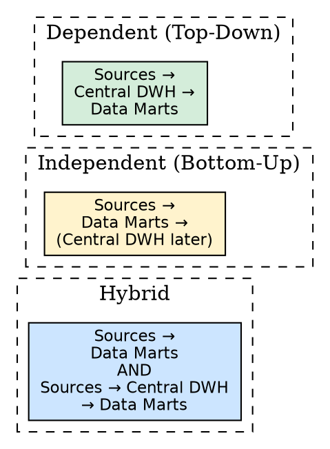
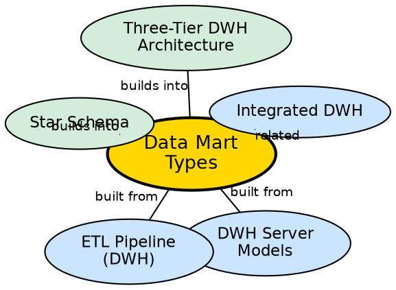

## The Problem

An enterprise data warehouse stores the entire company's data, but individual departments (Finance, Marketing, HR) only need their specific subset. Querying the full warehouse for departmental reports is slow and wasteful. On the other hand, building separate mini-warehouses for each department without coordination leads to inconsistent data definitions and contradictory reports.

## Core Idea

A **data mart** is a department-specific subset of a data warehouse, focused on a particular business function (e.g., Finance, Marketing). There are three types: **Dependent** (fed from the central warehouse, top-down), **Independent** (built directly from sources, bottom-up), and **Hybrid** (fed from both central warehouse and sources).

## How It Works

### 1. Dependent Data Mart (Top-Down Approach)
- **Flow:** External sources → ETL → **Central Data Warehouse** → Data Mart → Users
- **Mechanism:** The central warehouse is built first. Data marts are then created by extracting subsets from the central warehouse.
- **Advantages:** Single source of truth; consistent data across all marts; enterprise-wide integration.
- **Used by:** Large organizations (MNCs) that can afford the upfront investment in a central warehouse.
- **Approach:** Inmon's top-down methodology.

### 2. Independent Data Mart (Bottom-Up Approach)
- **Flow:** External sources → ETL → **Data Mart** → Users (central warehouse built later, if ever)
- **Mechanism:** Data marts are created directly from external sources without a central warehouse. The central warehouse is assembled later by integrating existing data marts.
- **Advantages:** Cost-effective; fast to implement; departments get analytical capability quickly.
- **Used by:** Small organizations and startups that cannot afford a full enterprise warehouse.
- **Approach:** Kimball's bottom-up methodology.

### 3. Hybrid Data Mart
- **Flow:** Two paths:
  - Path 1: External sources → ETL → Data Mart (direct)
  - Path 2: External sources → ETL → Central Data Warehouse → Data Mart (dependent)
- **Mechanism:** Data marts can receive data from both operational sources directly and the central warehouse. Provides flexibility.

### Data Mart Characteristics
- **Small and focused:** Designed for a particular department or function.
- **Flexible:** Easier to modify and adapt than a full enterprise warehouse.
- **Fast access:** Contains frequently accessed queries, enabling rapid business trend analysis.
- **Not comprehensive:** Does not store the huge volume of data across all departments.

## Visual Explanation

## Semantic Network

## Key Properties

- **Three types:** Dependent (top-down), Independent (bottom-up), Hybrid (both paths)
- **Department-specific:** Each data mart focuses on one business function
- **Size advantage:** Small, fast, and flexible compared to enterprise warehouses
- **Implementation speed:** Faster than building a full enterprise warehouse
- **Consistency trade-off:** Independent marts risk data silos; dependent marts ensure consistency

## Connections

- **Built from:** [[dwh-server-models|DWH Server Models]] — data marts are part of the Tiered model
- **Built from:** [[etl-pipeline-dwh|ETL Pipeline (DWH)]] — data marts are populated by ETL
- **Builds into:** [[wiki/data-warehouse/star-schema|Star Schema]] — data marts typically use star schema design
- **Related:** [[integrated-dwh|Integrated DWH]] — dependent marts inherit integration from central warehouse
- **Builds into:** [[three-tier-dwh-architecture|Three-Tier DWH Architecture]] — data marts are a Tier 1 variant
- **Contrasts with:** [[oltp-vs-olap|OLTP vs OLAP]] — data marts are OLAP constructs

## Edge Cases & Gotchas

- **Data silo risk:** Independent data marts can develop inconsistent definitions (e.g., different "revenue" calculations in Finance vs. Sales marts).
- **Integration cost:** Integrating independent data marts into a central warehouse later is complex and expensive.
- **Too many marts:** Creating too many data marts becomes a maintenance nightmare — each needs its own ETL pipeline.
- **Dependent mart latency:** Dependent marts are one ETL cycle behind the central warehouse, adding latency.

## Sources

- [[dw1-summary|Source: Data Warehouse — Definitions, Architecture, ETL, OLAP]] — data mart definition, three types, top-down vs. bottom-up
