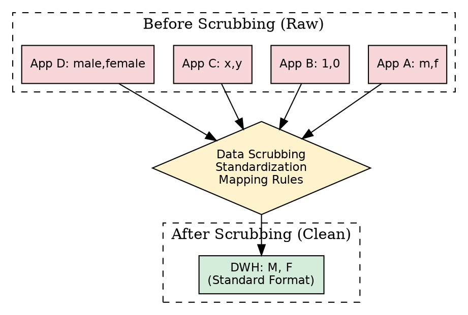
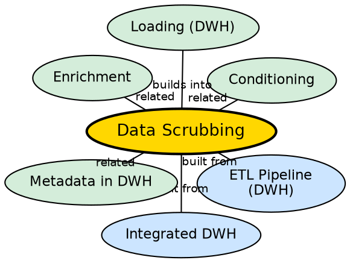

## The Problem

When data comes from multiple heterogeneous sources, the same real-world value is represented in dozens of different ways. One application stores gender as "M/F," another as "1/0," another as "Male/Female." Pipeline length is recorded in centimeters in one system, inches in another, and yards in a third. The same customer name appears as "Agrawal," "Agarwal," and "Aggarwal." Without standardizing these values, analytical queries produce inconsistent and unreliable results.

## Core Idea

**Data scrubbing** is the process of finding and correcting data inconsistencies by mapping disparate representations to a single, uniform standard. It handles value encoding, unit mapping, attribute name mapping, name resolution, and entity deduplication — transforming raw, inconsistent source data into clean, warehouse-ready data.

## How It Works

Data scrubbing applies multiple standardization techniques:

1. **Value Encoding:** Free-form values mapped to canonical codes.
   - "Male", "M", "1", "x", "male" → standard "M"
   - Different applications each use their own encoding; scrubbing creates a single mapping table.

2. **Unit Mapping:** Different units of measure converted to a single standard unit.
   - Pipeline lengths: cm, inches, feet, yards → single standard unit (e.g., meters)

3. **Attribute Name Mapping:** Different column names for the same concept unified.
   - "balance", "bal", "currbal", "balcurr" → "balance"

4. **Name Resolution:** Same entity spelled differently across sources reconciled.
   - "Agrawal", "Agarwal", "Aggarwal" → canonical spelling
   - Company names: "Persistent Systems", "PSPL", "Persistent Pvt. LTD." → one canonical name
   - City names: "Mumbai", "Bombay" → one canonical name

5. **Entity Resolution:** Different account numbers for the same customer mapped to a single ID.
   - Savings account number, loan account number, credit card number → single customer identification number

6. **Handling Invalid Data:** Blank entries in required fields and invalid product codes (e.g., manual entry errors like "9999999") are detected and handled.

7. **Invalid Code Detection:** Point-of-sale manual entry errors identified and corrected.

## Visual Explanation

## Semantic Network

## Key Properties

- **Multiple techniques:** Value encoding, unit mapping, attribute mapping, name resolution, entity resolution
- **Mapping-driven:** Uses predefined mapping tables to translate source values to standards
- **Error detection:** Identifies blank entries, invalid codes, and manual entry mistakes
- **Critical for quality:** Scrubbing quality directly determines the accuracy of warehouse analysis
- **Source-specific rules:** Each source system may need its own scrubbing rules

## Connections

- **Built from:** [[etl-pipeline-dwh|ETL Pipeline (DWH)]] — scrubbing is part of the Transform phase
- **Built from:** [[integrated-dwh|Integrated DWH]] — scrubbing implements the integration characteristic
- **Related:** [[enrichment-dwh|Enrichment]] — another transformation sub-process alongside scrubbing
- **Related:** [[conditioning-dwh|Conditioning]] — data type conversion complements value standardization
- **Builds into:** [[loading-dwh|Loading (DWH)]] — scrubbed data is loaded into the warehouse
- **Related:** [[metadata-in-dwh|Metadata in DWH]] — scrubbing rules are stored as metadata

## Edge Cases & Gotchas

- **Mapping table maintenance:** As new source values appear, mapping tables must be updated. Stale mappings produce incorrect scrubbing.
- **Over-standardization:** Aggressively mapping similar-but-different values to the same code can lose important distinctions.
- **Name resolution ambiguity:** "John Smith" in one system may not be the same as "J. Smith" in another — automated resolution can create false matches.
- **Performance cost:** Scrubbing millions of records through multiple mapping rules is computationally expensive.

## Sources

- [[dw1-summary|Source: Data Warehouse — Definitions, Architecture, ETL, OLAP]] — data scrubbing techniques, examples from source
