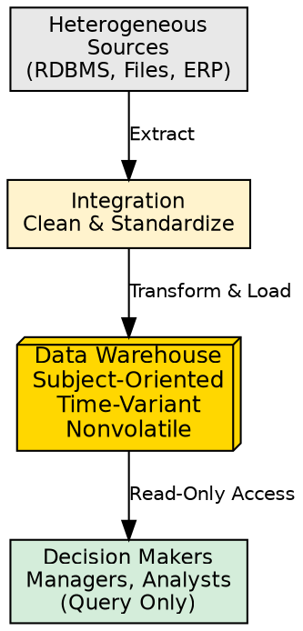
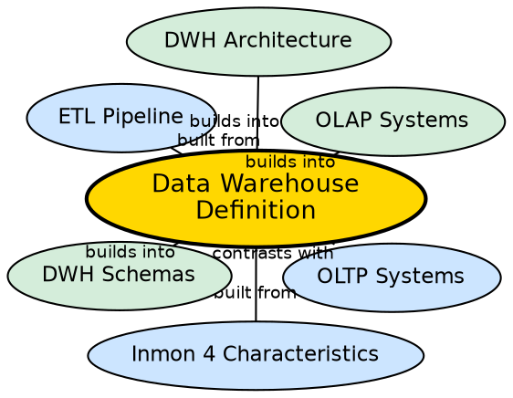

## The Problem

Transactional databases (**OLTP**) are optimized for fast row-level operations — inserts, updates, deletes — on current data. When management needs to analyze 5-10 years of historical data across multiple departments, running complex aggregation queries directly on production databases degrades performance and competes with live customer traffic.

## Core Idea

A data warehouse is a **subject-oriented, integrated, time-variant, and nonvolatile** collection of data designed to support management's decision-making process. Coined by W.H. Inmon (1993), this definition establishes the four pillars that distinguish a warehouse from any ordinary database. It centralizes data from heterogeneous sources into a single, consistent store optimized for analytical queries rather than transaction processing.

## How It Works

The four characteristics defined by Inmon work together as a system:

1. **Subject-Oriented:** Data is organized around major business subjects (Customer, Product, Sales) rather than around specific applications (Invoicing app, Shipping app). The focus shifts from "how data is processed" to "what data means for decision makers."
2. **Integrated:** Data from multiple heterogeneous sources (relational databases, flat files, ERP systems, external APIs) is extracted, cleaned, and converted into a consistent format before entering the warehouse. Date formats, naming conventions, and units of measure are standardized.
3. **Time-Variant:** Every record in the warehouse carries an explicit or implicit time element. The warehouse stores historical snapshots (typically 5-10 years), enabling trend analysis, year-over-year comparisons, and temporal pattern recognition.
4. **Nonvolatile:** Once data enters the warehouse, it is never updated or deleted in place. The only operations are **initial loading** and **querying (read access)**. This physical separation from the operational environment eliminates the need for transaction processing, recovery, and concurrency control mechanisms.

Barry Devin's complementary definition emphasizes that a warehouse is a "single, complete and consistent store of data obtained from a variety of different sources made available to end users in a way they can understand and use in business context."

## Visual Explanation

## Semantic Network

## Key Properties

- **Decision support focus:** Built for analysis and business intelligence, not daily operations
- **Single source of truth:** Integrates scattered data into one consistent repository
- **Historical depth:** Stores 5-10 years of data vs. OLTP's current-state focus
- **Read-optimized:** No UPDATE/DELETE after loading; only SELECT queries
- **Scale:** Ranges from terabytes ($10^{12}$ bytes) to zettabytes ($10^{21}$ bytes)
- **No concurrency control:** Nonvolatility removes need for locking/rollback mechanisms

## Connections

- **Built from:** [[subject-oriented-dwh|Subject-Oriented]] — first pillar of Inmon's definition
- **Built from:** [[integrated-dwh|Integrated]] — second pillar of Inmon's definition
- **Built from:** [[time-variant-dwh|Time-Variant]] — third pillar of Inmon's definition
- **Built from:** [[nonvolatile-dwh|Nonvolatile]] — fourth pillar of Inmon's definition
- **Contrasts with:** [[oltp-vs-olap|OLTP vs OLAP]] — warehouse is OLAP, not OLTP
- **Builds into:** [[three-tier-dwh-architecture|Three-Tier DWH Architecture]] — physical implementation of the definition
- **Related:** [[dwh-scale|Data Warehouse Scale]] — the massive size ranges warehouses operate at

## Edge Cases & Gotchas

- **Inmon vs. Kimball:** Inmon advocates top-down (enterprise warehouse first, then data marts); Kimball advocates bottom-up (data marts first, then conformed dimensions). Both definitions are valid but lead to different architectures.
- **"Nonvolatile" is not "immutable":** Data is refreshed periodically — new data is appended, not old data modified.
- **Data warehouse is not a data lake:** Warehouses require structured, cleaned data; lakes accept raw, unstructured data.
- **Misconception:** A warehouse is not just "a big database." The four characteristics (subject-oriented, integrated, time-variant, nonvolatile) are what make it a warehouse.