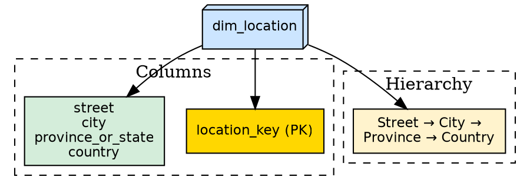
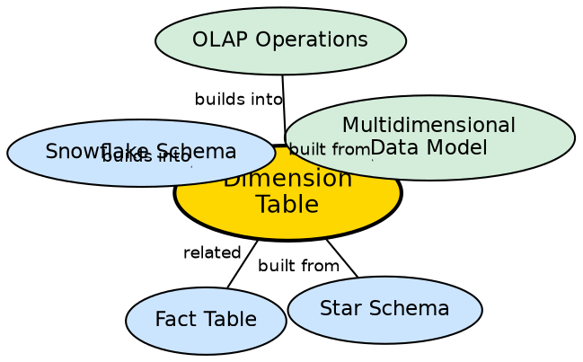

## The Problem

Numerical measures in a fact table (e.g., "$5,000 sold") are meaningless without context — $5,000 of what, when, where, and to whom? Without descriptive attributes that provide this context, analytical queries cannot filter, group, or label results in ways that business users understand.

## Core Idea

A **dimension table** contains descriptive attributes about a business entity that provide context for the numerical measures in the fact table. Each dimension represents an axis of analysis — Time (when), Item (what), Location (where), Customer (who). In a star schema, dimension tables are denormalized (all attributes in one table); in a snowflake schema, they may be normalized across multiple tables.

## How It Works

A dimension table has these characteristics:

1. **Primary key:** A unique identifier (surrogate key) that joins to the fact table's foreign key.
2. **Descriptive attributes:** Non-numerical columns that describe the entity.
   - `dim_location`: `location_key, street, city, province_or_state, country`
   - `dim_time`: `time_key, day, day_of_week, month, quarter, year, is_holiday`
   - `dim_item`: `item_key, item_name, type, brand, category`
   - `dim_customer`: `customer_key, name, age_group, city, is_premium`

3. **Hierarchical structure:** Many dimensions have natural hierarchies:
   - Location: Street → City → Province → Country
   - Time: Day → Month → Quarter → Year

4. **Denormalized in star schema:** All attributes live in one table, even if this causes redundancy (e.g., "British Columbia" repeated for every city in that province).

5. **May be normalized in snowflake schema:** Large dimensions can be split into multiple tables to reduce redundancy.

## Visual Explanation

## Semantic Network

## Key Properties

- **Descriptive:** Contains text/attribute columns, not numerical measures
- **Primary key:** Surrogate key joins to fact table
- **Hierarchical:** Natural hierarchies enable roll-up and drill-down
- **Denormalized in star:** All attributes in one table for query simplicity
- **Can be normalized in snowflake:** Large dimensions split to reduce redundancy

## Connections

- **Built from:** [[star-schema|Star Schema]] — dimension tables surround the fact table
- **Related:** [[fact-table|Fact Table]] — dimension tables provide context for facts
- **Builds into:** [[snowflake-schema|Snowflake Schema]] — dimensions may be normalized
- **Built from:** [[multidimensional-data-model|Multidimensional Data Model]] — dimensions are the axes of the cube
- **Builds into:** [[olap-operations|OLAP Operations]] — dimensions are the basis for roll-up, drill-down, slice, and dice
- **Related:** [[data-mart-types|Data Mart Types]] — data marts contain their own dimension tables

## Edge Cases & Gotchas

- **Slowly Changing Dimensions (SCDs):** When a dimension attribute changes (customer moves), the warehouse must decide whether to overwrite (Type 1), add a new row (Type 2), or add a new column (Type 3).
- **Junk dimensions:** Low-cardinality flags (e.g., "is_returned", "is_expedited") are sometimes combined into a single "junk dimension" to avoid creating many small dimension tables.
- **Role-playing dimensions:** The same dimension table (e.g., Date) can be joined to a fact table multiple times with different roles (order_date, ship_date, delivery_date).