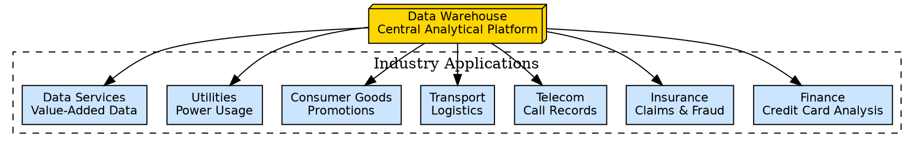
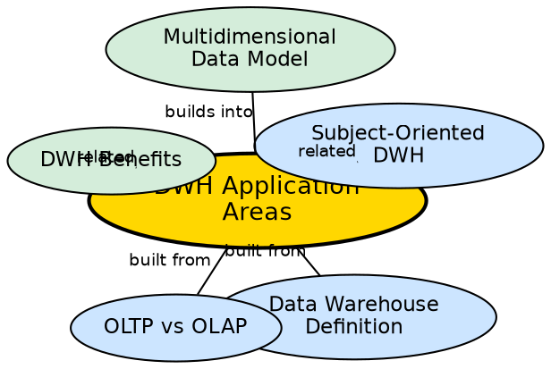

## The Problem

Data warehousing is an abstract concept until it is connected to real business problems. Without understanding how specific industries use data warehouses, it is difficult to appreciate the technology's value or design warehouses that meet actual business needs.

## Core Idea

**Data warehouse application areas** span diverse industries, each using the warehouse to solve domain-specific analytical problems. Finance analyzes credit card transactions, insurance detects fraud, telecommunications analyzes call records, transport optimizes logistics, consumer goods evaluates promotions, utilities tracks power usage, and data service providers create value-added data products.

## How It Works

Each industry applies the warehouse to its unique analytical challenges:

1. **Finance — Credit Card Analysis:**
   - Analyze spending patterns, identify high-value customers, detect unusual transaction patterns.
   - Cross-sell financial products based on transaction history.

2. **Insurance — Claims and Fraud Analysis:**
   - Analyze claim patterns to identify fraudulent claims.
   - Historical trend analysis for risk assessment and premium pricing.

3. **Telecommunications — Call Record Analysis:**
   - Analyze call patterns, peak usage times, and customer churn.
   - Optimize network capacity based on usage trends.

4. **Transport — Logistics Management:**
   - Optimize routing, fleet utilization, and delivery schedules.
   - Historical analysis of delays and their causes.

5. **Consumer Goods — Promotion Analysis:**
   - Measure promotion effectiveness across regions and time periods.
   - Compare sales performance before, during, and after promotional campaigns.

6. **Data Service Providers — Value-Added Data:**
   - Combine multiple data sources to create new analytical products.
   - Sell enriched, analyzed data to third parties.

7. **Utilities — Power Usage Analysis:**
   - Analyze consumption patterns for demand forecasting.
   - Identify peak usage periods for capacity planning.

## Visual Explanation

## Semantic Network

## Key Properties

- **Seven industry areas:** Finance, Insurance, Telecom, Transport, Consumer Goods, Data Services, Utilities
- **Common pattern:** Each industry uses the warehouse to find patterns in historical data
- **Decision support:** All applications support management decision-making, not operational processing
- **Cross-industry value:** The warehouse is a general-purpose analytical platform adaptable to any domain
- **Data-driven insights:** All applications transform raw transactional data into actionable intelligence

## Connections

- **Built from:** [[data-warehouse-definition|Data Warehouse Definition]] — applications demonstrate the definition in practice
- **Built from:** [[oltp-vs-olap|OLTP vs OLAP]] — each application uses OLAP, not OLTP
- **Related:** [[dwh-benefits|DWH Benefits]] — applications realize the benefits
- **Related:** [[subject-oriented-dwh|Subject-Oriented DWH]] — each application organizes data around business subjects
- **Builds into:** [[multidimensional-data-model|Multidimensional Data Model]] — applications analyze data along multiple dimensions

## Edge Cases & Gotchas

- **Industry-specific schemas:** Each industry may require different dimension designs (e.g., Telecom needs time-of-day dimensions, Finance needs currency dimensions).
- **Regulatory compliance:** Finance and Insurance applications must comply with data retention and privacy regulations.
- **Real-time needs:** Some applications (e.g., fraud detection) may require near-real-time data, pushing the boundaries of the warehouse's periodic refresh model.

## Sources

- [[dw1-summary|Source: Data Warehouse — Definitions, Architecture, ETL, OLAP]] — seven industry application areas
