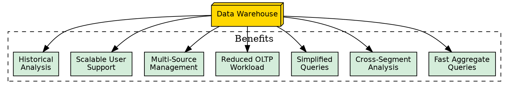
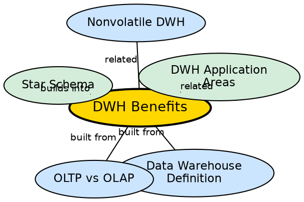

## The Problem

Building a data warehouse requires significant investment in infrastructure, ETL development, and ongoing maintenance. Decision-makers need to understand the concrete benefits to justify this investment. Without clear understanding of what the warehouse enables, organizations may not commit the resources needed for success.

## Core Idea

**Data warehouse benefits** are the analytical and operational advantages that result from having a centralized, subject-oriented, integrated, and nonvolatile data store. These include optimized aggregate query performance on large datasets, cross-departmental data comparison, simplified query building, reduced OLTP workload, efficient multi-source data management, scalable user support, and historical analysis capability.

## How It Works

The benefits manifest across seven dimensions:

1. **Aggregate query performance:** Designed to perform well with SUM, AVG, COUNT queries on massive datasets. The star schema and pre-aggregations enable fast responses that would be impossible on normalized OLTP databases.

2. **Cross-segment analysis:** Enables queries that cut across different company segments. Production data can be compared against inventory data even if they originated in different databases with different structures.

3. **Simplified query building:** Queries that would be complex in highly normalized databases are easier to build and maintain in the warehouse's denormalized schema. This decreases the workload on transaction systems and makes analysis accessible to more users.

4. **Reduced OLTP workload:** Analytical queries run against the warehouse, not the production database. This prevents analytical workloads from slowing down live transaction processing.

5. **Multi-source data management:** Efficient way to manage and report on data from a variety of sources that is non-uniform and scattered throughout a company.

6. **Scalable user support:** Efficient way to manage demand for information from many users simultaneously — the warehouse is read-only and designed for concurrent access.

7. **Historical analysis:** Provides the capability to analyze large amounts of historical data — trends, patterns, and changes over 5-10 year periods that are impossible in current-state OLTP systems.

## Visual Explanation

## Semantic Network

## Key Properties

- **Seven benefits:** Performance, cross-segment analysis, simplicity, OLTP relief, multi-source, scalability, history
- **User-facing:** Benefits directly impact end users' ability to analyze and decide
- **Cost-justifying:** Benefits provide the ROI case for warehouse investment
- **Measurable:** Query speed, user count, data volume — all benefits are quantifiable
- **Compound:** Benefits reinforce each other (e.g., reduced OLTP workload + fast queries = better decisions)

## Connections

- **Built from:** [[data-warehouse-definition|Data Warehouse Definition]] — benefits result from the four characteristics
- **Built from:** [[oltp-vs-olap|OLTP vs OLAP]] — benefits highlight why OLAP is needed alongside OLTP
- **Related:** [[wiki/data-warehouse/star-schema|Star Schema]] — denormalized schema enables simplified queries
- **Related:** [[dwh-application-areas|DWH Application Areas]] — applications realize the benefits
- **Related:** [[nonvolatile-dwh|Nonvolatile DWH]] — nonvolatility enables historical analysis

## Edge Cases & Gotchas

- **Benefits require proper design:** A poorly designed warehouse (wrong schema, bad ETL) will not deliver these benefits.
- **Time to value:** Benefits are not immediate — the warehouse must be populated with sufficient historical data before analysis becomes meaningful.
- **User adoption:** Benefits are only realized if users actually use the warehouse. Training and tool accessibility are critical.