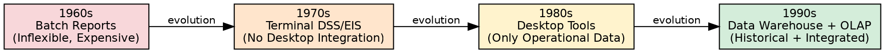
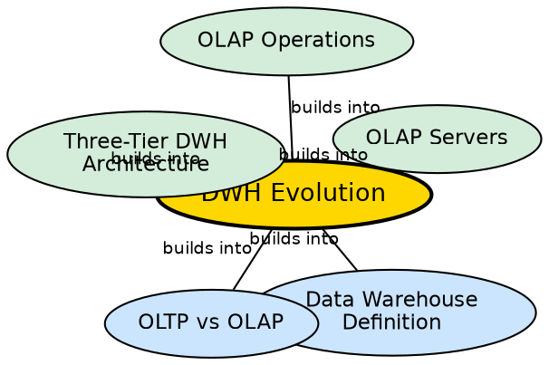

## The Problem

Data warehousing did not emerge fully formed — it evolved over decades as a response to the growing need for better data analysis tools. Understanding this evolution reveals why modern warehouses have their current architecture and why certain design decisions (subject-oriented, nonvolatile, integrated) were made.

## Core Idea

**Data warehouse evolution** traces the progression from 1960s batch reporting systems through 1990s data warehouses with integrated OLAP engines. Each decade addressed limitations of the previous approach: 60s batch reports were inflexible, 70s terminal-based systems lacked desktop integration, 80s desktop tools could only access operational databases, and 90s warehouses finally integrated historical data with analytical engines.

## How It Works

The evolution unfolded in four major phases:

1. **1960s — Batch Reports:**
   - Data was processed in batch jobs, producing printed reports.
   - **Problems:** Hard to find and analyze information; inflexible and expensive — every new request required reprogramming.
   - **Limitation:** No interactive analysis possible.

2. **1970s — Terminal-based DSS and EIS:**
   - Decision Support Systems (DSS) and Executive Information Systems (EIS) provided interactive terminal access.
   - **Problems:** Still inflexible; not integrated with desktop tools (spreadsheets, word processors).
   - **Limitation:** Users were locked into specific terminal interfaces.

3. **1980s — Desktop Data Access and Analysis Tools:**
   - Query tools, spreadsheets, and GUIs made analysis accessible on personal computers.
   - **Problems:** Easier to use, but could only access operational databases (not historical data).
   - **Limitation:** Analyzing production data degraded operational performance.

4. **1990s — Data Warehousing with Integrated OLAP:**
   - The modern era: dedicated warehouses with integrated OLAP engines and tools.
   - **Solution:** Separate analytical database (nonvolatile, historical, subject-oriented) with multidimensional analysis capabilities.
   - **Breakthrough:** Combined historical data integration with desktop-friendly analytical tools.

## Visual Explanation

## Semantic Network

## Key Properties

- **Four phases:** 60s (batch), 70s (terminal), 80s (desktop), 90s (warehouse + OLAP)
- **Problem-driven:** Each phase solved the previous phase's limitations
- **Increasing flexibility:** From reprogramming every query to interactive analysis
- **Data access expansion:** From batch reports → terminals → desktop → integrated warehouse
- **OLAP integration:** The 90s breakthrough was combining historical data with multidimensional analysis

## Connections

- **Builds into:** [[data-warehouse-definition|Data Warehouse Definition]] — evolution explains why the four characteristics exist
- **Builds into:** [[oltp-vs-olap|OLTP vs OLAP]] — the 80s limitation (only operational data) motivated the OLAP/OLTP split
- **Builds into:** [[three-tier-dwh-architecture|Three-Tier DWH Architecture]] — the architecture is the culmination of the evolution
- **Builds into:** [[olap-servers|OLAP Servers]] — OLAP integration was the 90s breakthrough
- **Related:** [[dwh-benefits|DWH Benefits]] — benefits represent the solution to all historical limitations

## Edge Cases & Gotchas

- **Pre-history:** Before the 1960s, data analysis was entirely manual — paper records and human calculation.
- **The term "data warehouse":** Coined by Bill Inmon in the early 1990s, formalizing concepts that had been evolving for decades.
- **Parallel developments:** The evolution described is specific to business intelligence; scientific computing had its own parallel evolution.

## Sources

- [[dw1-summary|Source: Data Warehouse — Definitions, Architecture, ETL, OLAP]] — evolution from 60s to 90s
