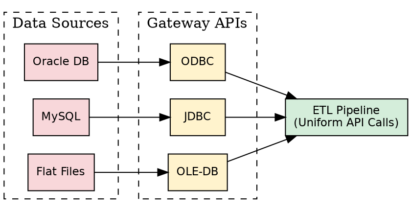
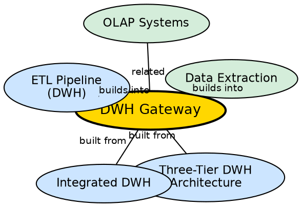

## The Problem

Operational data lives in diverse database systems — Oracle, SQL Server, MySQL, flat files, legacy mainframe databases — each with its own protocol, query language, and API. The data warehouse needs to extract data from all these sources, but writing custom extraction code for each system is impractical and unmaintainable.

## Core Idea

A **data warehouse gateway** is a standardized API provided by the underlying DBMS that allows client programs (like ETL tools) to generate SQL and execute queries against heterogeneous data sources through a uniform interface. Instead of writing source-specific code, the ETL pipeline uses a single gateway API to connect to any supported database.

## How It Works

Gateways act as translation layers between the ETL process and the source database:

1. **ETL tool calls gateway API:** The ETL process invokes standardized functions (e.g., `SQLConnect()`, `SQLExecute()`) without knowing the specifics of the target database.
2. **Gateway translates to native protocol:** The gateway converts the standardized calls into the database's native protocol and query dialect.
3. **Results returned in standard format:** Query results are returned in a consistent format regardless of the source system.

Key gateway technologies:

- **ODBC (Open Database Connectivity):** Microsoft's universal API for accessing relational databases. Supports SQL-based databases through driver-specific implementations.
- **JDBC (Java Database Connectivity):** Java's equivalent of ODBC. Allows Java programs to connect to any database with a JDBC driver.
- **OLE-DB (Object Linking and Embedding for Databases):** Microsoft's COM-based API that goes beyond relational databases to access non-relational data sources (email, spreadsheets, etc.).

The gateway sits between the data sources and the ETL pipeline in the three-tier architecture, enabling the "integrated" characteristic of the warehouse.

## Visual Explanation

## Semantic Network

## Key Properties

- **Uniform interface:** One API to access all supported databases, regardless of vendor
- **SQL generation:** Gateways allow client programs to generate SQL code executed at the server
- **Driver-based:** Each database vendor provides a driver that implements the gateway API
- **Transparent translation:** ETL tools do not need to know the native protocol of each source
- **Part of Tier 1:** Gateways operate at the bottom tier of the three-tier architecture

## Connections

- **Built from:** [[three-tier-dwh-architecture|Three-Tier DWH Architecture]] — gateways connect Tier 1 to external sources
- **Built from:** [[integrated-dwh|Integrated DWH]] — gateways enable integration of heterogeneous sources
- **Builds into:** [[etl-pipeline-dwh|ETL Pipeline (DWH)]] — ETL uses gateways to extract data
- **Builds into:** [[data-extraction|Data Extraction]] — gateways are the technical mechanism for extraction
- **Related:** [[oltp-vs-olap|OLTP vs OLAP]] — gateways bridge OLTP sources to the OLAP warehouse

## Edge Cases & Gotchas

- **Driver compatibility:** Not all database features are supported through every gateway driver. Native queries may be needed for advanced operations.
- **Performance overhead:** Gateway translation adds a layer of abstraction that can slow down bulk extraction. Native bulk-copy tools may be faster for large volumes.
- **Security concerns:** Gateway connections require credentials for each source system — credential management becomes a security challenge.
- **OLE-DB is deprecated:** Microsoft has deprecated OLE-DB in favor of newer APIs, but it remains in legacy systems.