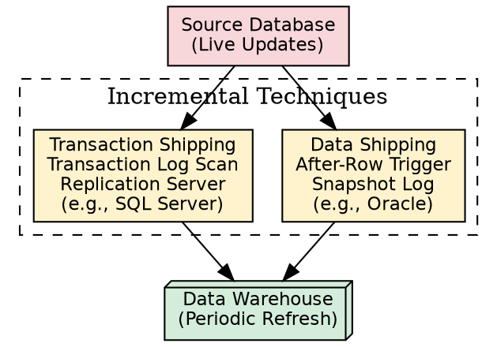
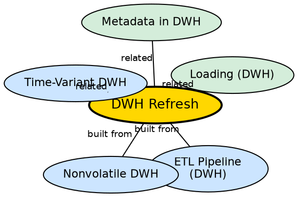

## The Problem

Source systems are continuously updated — new sales recorded, customer addresses changed, inventory levels adjusted. The warehouse, being nonvolatile, does not receive these updates in real-time. Without a systematic refresh mechanism, the warehouse data becomes increasingly stale, and analytical decisions are based on outdated information.

## Core Idea

**DWH Refresh** is the process of propagating source data updates to the warehouse on a scheduled basis. Administrators set refresh policies based on user needs and system traffic — typically periodic (nightly, weekly) rather than real-time, because real-time refresh is prohibitively expensive. Incremental techniques are used to propagate only the changes, not the entire dataset.

## How It Works

### When to Refresh

1. **Periodic refresh:** Most common approach. Refresh on a schedule — every night, every week, or after significant business events (end of month, end of quarter).
2. **Event-driven refresh:** Trigger refresh after significant events — a major system migration, a data quality incident.
3. **Real-time refresh:** Possible but very expensive. Used only when the warehouse requires up-to-the-minute data (e.g., stock quotation dashboards). Rarely implemented in practice.

### How to Refresh (Incremental Techniques)

Two primary approaches for detecting and propagating changes:

**1. Data Shipping (e.g., Oracle Replication Server):**
- A table in the warehouse is treated as a **remote snapshot** of a table in the source database.
- An **after-row trigger** is set on the source table.
- When a row is updated in the source, the trigger fires and updates a **snapshot log table**.
- The updated data is then propagated from the snapshot log to the warehouse.
- The warehouse receives the actual data changes (the "data").

**2. Transaction Shipping (e.g., Sybase Replication Server, Microsoft SQL Server):**
- The source database's **transaction log** is scanned for updates to replicated tables.
- Modified log records are transferred to a **replication server**.
- The replication server packages the corresponding transactions and sends them to the warehouse.
- The warehouse receives the transactions and replays them to apply the updates.
- The warehouse receives the transaction records (the "how"), not just the resulting data.

### Policy Configuration

- Different sources can have different refresh policies.
- High-priority sources (e.g., sales data) may be refreshed nightly.
- Low-priority sources (e.g., historical reference data) may be refreshed monthly.

## Visual Explanation

## Semantic Network

## Key Properties

- **Periodic by default:** Nightly or weekly refresh, not real-time
- **Incremental:** Only propagates changes, not full reloads
- **Two techniques:** Data Shipping (snapshot + trigger) and Transaction Shipping (log scan + replication)
- **Policy-driven:** Different sources can have different refresh schedules
- **Admin-controlled:** Refresh policies set by administrators based on user needs

## Connections

- **Built from:** [[etl-pipeline-dwh|ETL Pipeline (DWH)]] — refresh is the fourth phase
- **Built from:** [[nonvolatile-dwh|Nonvolatile DWH]] — refresh is the only way to update nonvolatile data
- **Built from:** [[loading-dwh|Loading (DWH)]] — refresh uses similar batch loading mechanisms
- **Related:** [[time-variant-dwh|Time-Variant DWH]] — refresh adds new time slices to the historical record
- **Related:** [[metadata-in-dwh|Metadata in DWH]] — refresh rules and schedules stored in metadata

## Edge Cases & Gotchas

- **Refresh window conflicts:** Refreshing during business hours can impact query performance. Refresh should be scheduled during off-peak hours.
- **Data Shipping vs. Transaction Shipping:** Data Shipping sends the actual changed data; Transaction Shipping sends the transaction log entries. Data Shipping is simpler; Transaction Shipping preserves transaction semantics.
- **Conflicting updates:** If a source record is updated twice between refresh cycles, only the final state may be captured (unless the technique preserves all intermediate states).
- **Schema mismatch during refresh:** If the source schema changes between refresh cycles, the ETL pipeline must be updated first.

## Sources

- [[dw1-summary|Source: Data Warehouse — Definitions, Architecture, ETL, OLAP]] — refresh policies, data shipping, transaction shipping
