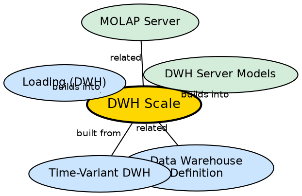

## The Problem

Data warehouses are not small databases — they are among the largest databases in existence. Understanding the scale is essential for appreciating the engineering challenges: storage architecture, query optimization, ETL throughput, and refresh performance all behave differently at terabyte and petabyte scale than at gigabyte scale.

## Core Idea

**Data warehouse scale** spans from terabytes ($10^{12}$ bytes) to zettabytes ($10^{21}$ bytes) and beyond. Real-world examples include Walmart at 24 terabytes, Geographic Information Systems at petabytes, National Medical Records at exabytes, weather imaging at zettabytes, and intelligence agency video archives at yottabytes ($10^{24}$ bytes). These volumes drive every architectural decision in warehouse design.

## How It Works

The scale hierarchy determines technology choices at every level:

| Scale | Bytes | Example | Implications |
|-------|-------|---------|-------------|
| Terabytes | $10^{12}$ | Walmart (24 TB) | Single server possible; basic partitioning |
| Petabytes | $10^{15}$ | GIS Systems | Distributed storage required; parallel query processing |
| Exabytes | $10^{18}$ | National Medical Records | Multi-datacenter; specialized columnar databases |
| Zettabytes | $10^{21}$ | Weather Images | Global infrastructure; extreme parallelism |
| Yottabytes | $10^{24}$ | Intelligence Videos | Beyond current technology; theoretical limit |

At each scale level:
- **Storage architecture** evolves from single disks to RAID arrays to distributed file systems.
- **Query processing** evolves from single-threaded execution to parallel/distributed execution.
- **ETL design** evolves from simple batch loads to parallel streaming pipelines.
- **Refresh strategies** must account for the time it takes to process billions of records.

## Visual Explanation

```dot
digraph dwh_scale {
  rankdir=LR
  node [shape=box style=filled fontname="Helvetica" fontsize=11]
  edge [fontname="Helvetica" fontsize=10]

  tb [label="Terabytes\n10^12 bytes\nWalmart: 24 TB" fillcolor="#d4edda"]
  pb [label="Petabytes\n10^15 bytes\nGIS Systems" fillcolor="#cce5ff"]
  eb [label="Exabytes\n10^18 bytes\nMedical Records" fillcolor="#fff3cd"]
  zb [label="Zettabytes\n10^21 bytes\nWeather Images" fillcolor="#ffe5cc"]
  yb [label="Yottabytes\n10^24 bytes\nIntel Videos" fillcolor="#f8d7da"]

  tb -> pb -> eb -> zb -> yb [label="increasing scale"]
}
```

## Semantic Network

## Key Properties

- **Five levels:** Terabytes → Petabytes → Exabytes → Zettabytes → Yottabytes
- **Exponential growth:** Each level is 1,000× the previous
- **Real-world anchors:** Walmart (TB), GIS (PB), Medical (EB), Weather (ZB), Intel (YB)
- **Drives architecture:** Scale determines storage, processing, and ETL technology choices
- **Historical accumulation:** Time-variance (5-10 year history) is the primary driver of growth

## Connections

- **Related:** [[data-warehouse-definition|Data Warehouse Definition]] — scale is a consequence of the warehouse's design
- **Built from:** [[time-variant-dwh|Time-Variant DWH]] — historical accumulation drives scale growth
- **Builds into:** [[loading-dwh|Loading (DWH)]] — loading strategies must handle massive volumes
- **Builds into:** [[dwh-server-models|DWH Server Models]] — server architecture choices depend on scale
- **Related:** [[molap-server|MOLAP Server]] — MOLAP is limited at large scale due to storage constraints

## Edge Cases & Gotchas

- **Yottabytes are theoretical:** No existing system approaches yottabyte scale — this is a future projection.
- **Scale is not just storage:** Query performance, ETL throughput, and refresh time all scale non-linearly.
- **Compression reduces effective scale:** Modern columnar databases compress data 5-10×, making a petabyte warehouse occupy only 100-200 TB of physical storage.
- **Archive tiering:** Not all data needs to be on fast storage. Old data can be moved to cheaper archival storage while remaining queryable.

## Sources

- [[dw1-summary|Source: Data Warehouse — Definitions, Architecture, ETL, OLAP]] — scale hierarchy from terabytes to zettabytes
