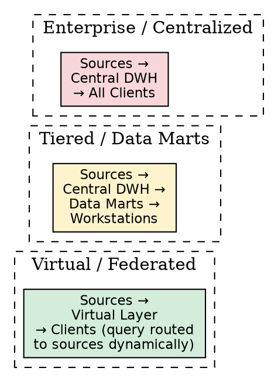
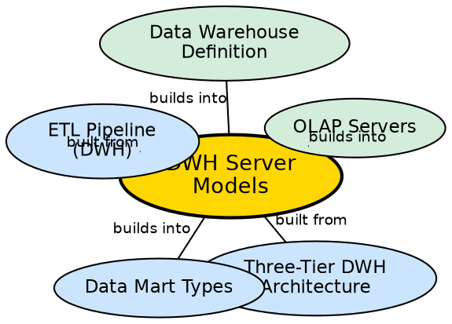

## The Problem

A company needs to implement a data warehouse, but there is no single "right way" to physically store and organize the data. Should all data go into one massive central database (easy to maintain but prone to bottlenecks)? Should each department get its own smaller database (fast but potentially inconsistent)? Or should there be no physical warehouse at all, just a virtual layer that queries the source systems directly?

## Core Idea

**Data Warehouse Server Models** define the physical architecture of how warehouse data is stored and accessed. There are three primary models: **Enterprise/Centralized Warehouse** (one massive central database), **Tiered/Data Mart** (central warehouse with departmental subsets), and **Virtual/Federated Warehouse** (no physical storage, just a logical query layer).

## How It Works

### 1. Enterprise / Centralized Warehouse Server
- **Structure:** One single database stores all data necessary for business analysis across the entire company.
- **Mechanism:** External sources feed data through ETL into the central repository. All clients query this single database.
- **Best for:** Companies with centralized operational frameworks where all data naturally flows to a central point.
- **Advantages:** Single data model makes access easy; centralized maintenance is simpler than managing distributed systems.
- **Disadvantages:** Network bottlenecks from high traffic; limited concurrent access (single copy in single location); high dependency on network connectivity.

### 2. Tiered Data Warehouse Server / Data Marts
- **Structure:** A physical central data warehouse exists, with local **data marts** on different tiers storing copies or summaries of the central data.
- **Mechanism:** Data flows from sources → central warehouse → data marts → workstations. Each tier may contain increasingly summarized data.
- **Best for:** Large organizations with department-specific analytical needs.
- **Advantages:** Department-level queries are fast (local data mart); flexible sizing; choices of dependent, independent, or hybrid data mart models.
- **Disadvantages:** Too many data marts become cumbersome to maintain; potential data consistency issues.

### 3. Virtual / Federated Data Warehouse Server
- **Structure:** No physical central database exists. A logical layer provides a unified view over the source systems.
- **Mechanism:** When a user queries the virtual warehouse, the system dynamically translates the query and routes it to the appropriate source databases or data marts. Results are aggregated and returned.
- **Best for:** Organizations that cannot afford the cost of building and maintaining a physical warehouse.
- **Advantages:** No data duplication; no ETL infrastructure needed; always reflects current source data.
- **Disadvantages:** Query performance depends on source system availability and speed; complex query translation; no historical data unless sources maintain it.

## Visual Explanation

## Semantic Network

## Key Properties

- **Three models:** Enterprise (centralized), Tiered (with data marts), Virtual (logical only)
- **Physical vs. logical:** Enterprise and Tiered are physical; Virtual is logical
- **Trade-off:** Centralization (simplicity) vs. distribution (performance) vs. virtuality (cost savings)
- **Scalability varies:** Virtual scales poorly under heavy load; Tiered scales best for large organizations
- **Data consistency:** Centralized ensures single truth; Tiered risks inconsistency across marts

## Connections

- **Built from:** [[three-tier-dwh-architecture|Three-Tier DWH Architecture]] — server models implement Tier 1
- **Builds into:** [[data-mart-types|Data Mart Types]] — Tiered model uses dependent, independent, or hybrid data marts
- **Built from:** [[etl-pipeline-dwh|ETL Pipeline (DWH)]] — Enterprise and Tiered models require ETL
- **Builds into:** [[olap-servers|OLAP Servers]] — server models determine which OLAP implementation is used
- **Builds into:** [[data-warehouse-definition|Data Warehouse Definition]] — server models are the physical implementation
- **Contrasts with:** [[oltp-vs-olap|OLTP vs OLAP]] — server models are the OLAP-side architecture

## Edge Cases & Gotchas

- **Virtual warehouse is not "real-time":** Even though it queries source systems directly, query translation and aggregation add latency.
- **Hybrid approaches:** Many companies use a combination — Enterprise warehouse for corporate reporting, Data Marts for departmental analysis.
- **Cost progression:** Virtual (cheapest) → Tiered (moderate) → Enterprise (most expensive to build, but cheapest per-query at scale).
- **Network dependency:** Centralized warehouses are highly dependent on network connectivity — a network failure blocks all analysis.