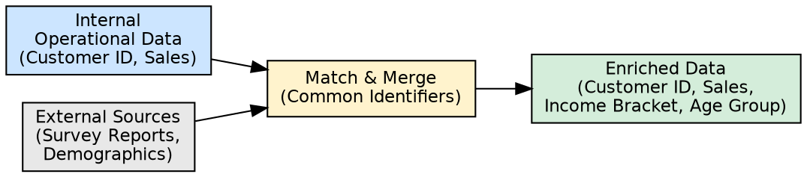
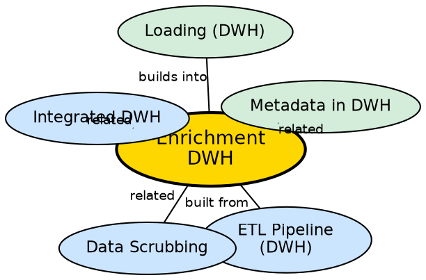

## The Problem

Operational data generated within a company provides only an internal view of business activities. It cannot answer questions like "How does our customer base compare to national demographics?" or "What is the credit risk profile of our customers?" — questions that require external context. Without augmenting internal data with outside information, the warehouse provides an incomplete analytical picture.

## Core Idea

**Enrichment** is the process of bringing data from external sources to augment and enhance operational data stored in the warehouse. It adds context that internal systems alone cannot provide — survey reports, demographic data, market research, credit scores — enabling deeper, more informed analysis.

## How It Works

Enrichment operates as a sub-process within the ETL transformation phase:

1. **Identify enrichment needs:** Determine which analytical questions cannot be answered with internal data alone. Examples: customer demographics, market segmentation, geographic risk factors.
2. **Source external data:** Obtain data from external providers — survey companies, government databases, market research firms, data brokers.
3. **Match and merge:** Align external data with internal records using common identifiers (customer ID, address, ZIP code). This requires the same scrubbing techniques used for internal data integration.
4. **Augment records:** Append external attributes to internal records. For example, adding a survey-derived "income bracket" field to each customer record.
5. **Validate:** Ensure enrichment did not introduce inconsistencies or duplicates.

**Example:** A company has internal sales data per customer. By enriching with a survey report containing demographic data, the warehouse can now answer: "What is the average purchase value by income bracket?" — a question impossible with internal data alone.

## Visual Explanation

## Semantic Network

## Key Properties

- **External augmentation:** Adds data that internal systems cannot generate
- **Common identifiers:** Requires matching keys (ID, address, ZIP) to merge external with internal data
- **Complementary to scrubbing:** Uses the same standardization techniques as data scrubbing
- **Enables new analyses:** Creates analytical dimensions that did not exist in internal data
- **Ongoing cost:** External data often requires subscription or purchase, creating recurring costs

## Connections

- **Built from:** [[etl-pipeline-dwh|ETL Pipeline (DWH)]] — enrichment is part of the Transform phase
- **Related:** [[data-scrubbing|Data Scrubbing]] — enrichment uses scrubbing techniques for matching and merging
- **Related:** [[integrated-dwh|Integrated DWH]] — enrichment extends integration to external sources
- **Builds into:** [[loading-dwh|Loading (DWH)]] — enriched data is loaded into the warehouse
- **Related:** [[metadata-in-dwh|Metadata in DWH]] — enrichment source information stored in metadata

## Edge Cases & Gotchas

- **Data quality of external sources:** External data may be less reliable than internal data. Validation is critical.
- **Privacy and compliance:** Enriching customer data with external sources may trigger privacy regulations (GDPR, CCPA).
- **Identifier matching accuracy:** Inexact matching (fuzzy address matching, partial name matching) can create incorrect merges.
- **External data staleness:** Survey data and demographic data become outdated. Enrichment must be refreshed periodically.

## Sources

- [[dw1-summary|Source: Data Warehouse — Definitions, Architecture, ETL, OLAP]] — enrichment as transformation sub-process
