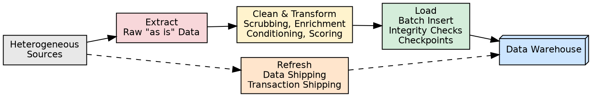
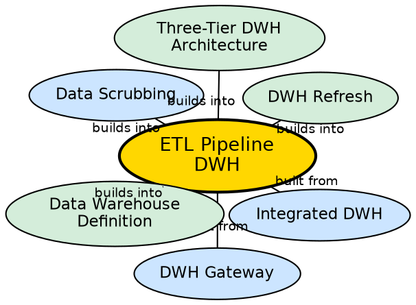

## The Problem

Raw operational data from multiple heterogeneous sources is inconsistent, incomplete, and formatted differently across systems. Loading this "dirty" data directly into the warehouse would produce unreliable analysis results — garbage in, garbage out. The warehouse needs a systematic pipeline that extracts data from sources, cleans and standardizes it, transforms it into a uniform structure, and loads it reliably into the warehouse.

## Core Idea

The **ETL (Extract, Transform, Load) pipeline** is the four-phase backend process that populates and refreshes a data warehouse. **Extract** gathers raw data from heterogeneous sources. **Transform** cleans, standardizes, enriches, and restructures the data. **Load** inserts the cleaned data into the warehouse. **Refresh** propagates ongoing source updates to keep the warehouse current.

## How It Works

### Phase 1: Data Extraction
- Gathers data from multiple heterogeneous sources: production databases, legacy systems, internal office systems, external systems, and metadata.
- Data is captured in its **"as is"** (raw) state — no modifications at this stage.
- Uses **gateways** (ODBC, JDBC, OLE-DB) to connect to diverse source systems.

### Phase 2: Data Cleaning and Transformation
This is the heaviest phase, involving multiple sub-processes:
- **Data scrubbing:** Standardizes values (encoding, units, attribute names, name resolution).
- **Enrichment:** Augments operational data with external sources (e.g., survey reports).
- **Conditioning:** Converts source data types to target warehouse data types.
- **Scoring:** Computes probabilities (e.g., customer purchase likelihood).
- **Householding:** Groups records by shared attributes (e.g., same address) to eliminate redundancy.

### Phase 3: Loading
- Inserts cleaned data into the warehouse.
- Checks integrity constraints, sorts, and summarizes data.
- Uses **batch load utilities** with **checkpoint** support — if a load fails, it resumes from the last checkpoint rather than restarting.
- Must handle very large data volumes; sequential loads can take hours.

### Phase 4: Refresh
- Propagates source updates to the warehouse.
- Two techniques: **Data Shipping** (remote snapshots with after-row triggers) and **Transaction Shipping** (transaction log scanning and replication).

## Visual Explanation

## Semantic Network

## Key Properties

- **Four phases:** Extract, Transform, Load, Refresh — each with distinct responsibilities
- **Batch-oriented:** Loading happens in batches, not row-by-row, for performance
- **Checkpoint support:** Failed loads resume from the last checkpoint, not from scratch
- **Data quality critical:** Scrubbing and transformation determine the warehouse's analytical accuracy
- **Resource intensive:** Transformation and scrubbing are CPU/memory intensive operations

## Connections

- **Built from:** [[integrated-dwh|Integrated DWH]] — ETL implements the integration characteristic
- **Built from:** [[dwh-gateway|DWH Gateway]] — gateways provide the extraction mechanism
- **Builds into:** [[data-scrubbing|Data Scrubbing]] — scrubbing is a core transformation sub-process
- **Builds into:** [[dwh-refresh|DWH Refresh]] — refresh is the fourth phase of ETL
- **Builds into:** [[three-tier-dwh-architecture|Three-Tier DWH Architecture]] — ETL feeds Tier 1
- **Related:** [[data-warehouse-definition|Data Warehouse Definition]] — ETL enables all four Inmon characteristics

## Edge Cases & Gotchas

- **Garbage In, Garbage Out:** Poor scrubbing produces unreliable analysis. The transformation phase is where most ETL failures occur.
- **Full load vs. incremental:** Full loads rebuild the entire warehouse (slow but safe); incremental loads only process changes (fast but complex to implement correctly).
- **Load failure recovery:** Without checkpoints, a 10-hour load that fails at hour 9.5 must restart completely.
- **Schema evolution:** When source systems change their schema, ETL pipelines must be updated — this is a common maintenance burden.

## Sources

- [[dw1-summary|Source: Data Warehouse — Definitions, Architecture, ETL, OLAP]] — ETL four phases, backend process details
