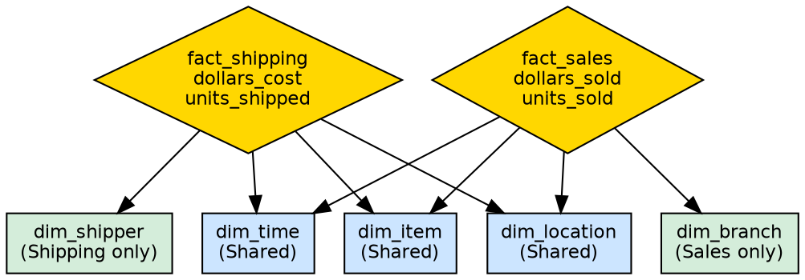
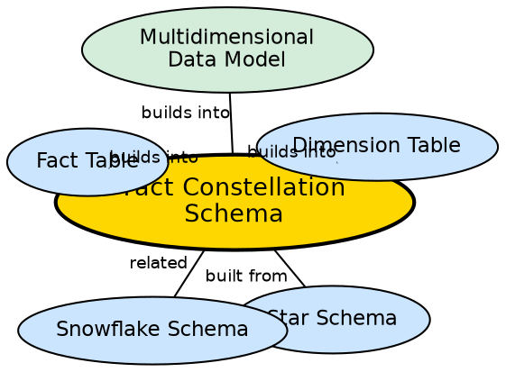

## The Problem

A single fact table can measure only one business process. But an enterprise needs to analyze multiple processes — sales, shipping, returns, inventory — simultaneously. Each process has its own metrics and may share some dimensions (Time, Item) with others. A single star schema cannot represent this multi-process reality.

## Core Idea

**Fact Constellation Schema** (also called **Galaxy Schema**) has **multiple fact tables** that share common dimension tables. It extends the star schema by allowing several fact tables (e.g., Sales, Shipping) to coexist and share dimensions (e.g., Time, Item, Location), enabling analysis across multiple business processes within a single model.

## How It Works

The galaxy schema involves:

1. **Multiple fact tables:** Each fact table represents a different business process.
   - `fact_sales`: `time_key, item_key, branch_key, location_key, dollars_sold, units_sold`
   - `fact_shipping`: `item_key, time_key, shipper_key, from_location, to_location, dollars_cost, units_shipped`

2. **Shared dimensions:** Some dimensions are common across fact tables.
   - `dim_time`, `dim_item`, `dim_location` are shared between Sales and Shipping.
   - `dim_branch` is specific to Sales.
   - `dim_shipper` is specific to Shipping.

3. **Process-specific dimensions:** Each fact table may have unique dimensions.
   - Sales has `branch_key`; Shipping has `shipper_key`, `from_location`, `to_location`.

4. **Cross-process analysis:** Shared dimensions enable queries that span multiple fact tables — e.g., "Compare sales revenue to shipping cost by item category."

## Visual Explanation

## Semantic Network

## Key Properties

- **Multiple fact tables:** Each represents a different business process
- **Shared dimensions:** Common dimensions (Time, Item, Location) are shared across fact tables
- **Process-specific dimensions:** Some dimensions are unique to individual fact tables
- **Enterprise-scale:** Designed for complex organizations with multiple business processes
- **Cross-process analysis:** Enables analysis spanning multiple business processes

## Connections

- **Built from:** [[star-schema|Star Schema]] — galaxy is an extension with multiple fact tables
- **Related:** [[snowflake-schema|Snowflake Schema]] — both are schema variants beyond the basic star
- **Builds into:** [[fact-table|Fact Table]] — galaxy uses multiple fact tables
- **Builds into:** [[dimension-table|Dimension Table]] — shared dimensions connect all fact tables
- **Builds into:** [[multidimensional-data-model|Multidimensional Data Model]] — galaxy implements the dimensional model at scale
- **Contrasts with:** [[star-schema|Star Schema]] — star has one fact table, galaxy has many

## Edge Cases & Gotchas

- **Complexity:** Managing multiple fact tables with shared and unique dimensions is significantly more complex than a single star schema.
- **Dimension conformance:** Shared dimensions must have consistent definitions across all fact tables. If "Time" means different things in Sales vs. Shipping, cross-process analysis fails.
- **Implementation challenge:** Galaxy schemas are difficult to design and maintain — they are the most complex of the three schema types.
- **When to use:** Only needed for enterprise-level companies with genuinely distinct but related business processes.