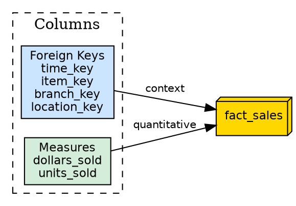
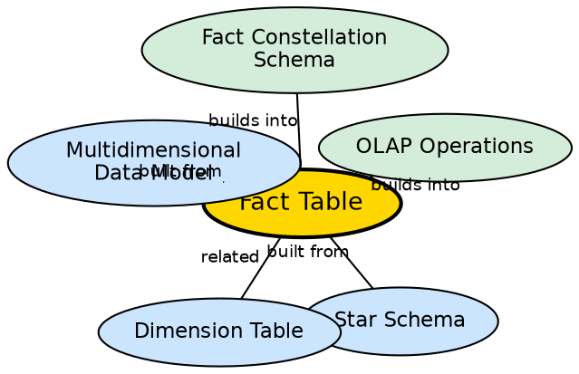

## The Problem

Business analysis requires quantitative measurement — how many units were sold, how much revenue was generated, how many items were shipped. But these numbers have no meaning without context: when, what product, where, and through which channel. The raw numbers (facts) must be stored alongside the references that give them meaning.

## Core Idea

A **fact table** is the central table in a star schema that contains measurable business events (numerical metrics/measurements) and foreign keys linking to surrounding dimension tables. It represents the "what happened" of the business — the quantitative events that analysis seeks to understand through the lens of dimensions.

## How It Works

The fact table has two types of columns:

1. **Measures (facts):** Numerical values that represent business events.
   - `dollars_sold`, `units_sold`, `dollars_cost`, `units_shipped`
   - These are the values that get aggregated (SUM, AVG, COUNT) in analytical queries.

2. **Foreign keys:** References to dimension tables that provide context.
   - `time_key`, `item_key`, `branch_key`, `location_key`
   - Each key links to a dimension table that describes that axis of analysis.

**Example fact table (Sales):**
```
fact_sales:
  time_key (FK → dim_time)
  item_key (FK → dim_item)
  branch_key (FK → dim_branch)
  location_key (FK → dim_location)
  dollars_sold (measure)
  units_sold (measure)
```

In a fact constellation schema, multiple fact tables can coexist (e.g., `fact_sales` and `fact_shipping`), each with its own measures but potentially sharing dimension tables.

## Visual Explanation



## Semantic Network



## Key Properties

- **Central position:** Sits at the center of the star schema
- **Two column types:** Foreign keys (context) and measures (quantitative values)
- **Largest table:** Typically has the most rows (one per business event)
- **Additive measures:** Most measures are additive (can be summed across dimensions)
- **Granularity:** The fact table's granularity determines the finest level of detail available for analysis

## Connections

- **Built from:** [[wiki/data-warehouse/star-schema|Star Schema]] — fact table is the central component
- **Related:** [[wiki/data-warehouse/dimension-table|Dimension Table]] — fact table references dimension tables via foreign keys
- **Built from:** [[multidimensional-data-model|Multidimensional Data Model]] — facts are the cell values in the cube
- **Builds into:** [[olap-operations|OLAP Operations]] — operations aggregate and filter fact values
- **Builds into:** [[fact-constellation-schema|Fact Constellation Schema]] — galaxy schema uses multiple fact tables
- **Related:** [[snowflake-schema|Snowflake Schema]] — fact tables also exist in snowflake schemas

## Edge Cases & Gotchas

- **Non-additive measures:** Some measures (e.g., ratios, percentages) cannot be meaningfully summed. These require special handling.
- **Fact table granularity:** Choosing the right granularity (daily vs. monthly, per-transaction vs. per-day) is a critical design decision that cannot be easily changed later.
- **Surrogate keys:** Fact tables use surrogate (integer) keys, not natural keys, for performance and to handle slowly changing dimensions.

## Sources

- [[dw1-summary|Source: Data Warehouse — Definitions, Architecture, ETL, OLAP]] — fact table definition, measures, foreign keys
