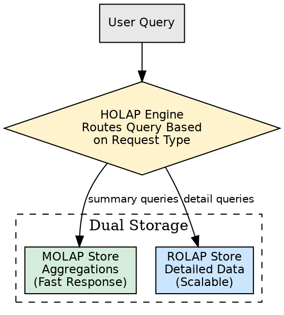
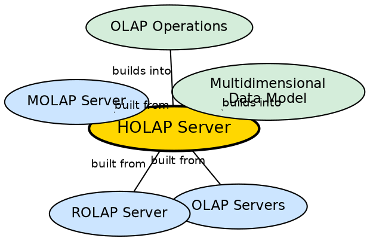

## The Problem

ROLAP handles large data volumes but has slow query response times. MOLAP has fast response times but cannot store detailed data and has limited scalability. Neither solution alone satisfies organizations that need both fast access to aggregated data and the ability to drill down into massive detailed datasets.

## Core Idea

**HOLAP (Hybrid OLAP)** combines the higher scalability of ROLAP with the faster computation of MOLAP. It stores large volumes of detailed information in relational tables (ROLAP) while storing frequently accessed aggregations separately in a MOLAP store. This provides fast responses for summary queries while retaining the ability to access full detail when needed.

## How It Works

HOLAP divides data storage and processing based on usage patterns:

1. **Detailed data → ROLAP storage:**
   - The full granular data (individual transactions, daily records) is stored in relational tables.
   - This provides unlimited scalability — the ROLAP layer can handle terabytes of detailed data.
   - Queries requiring row-level detail are directed to this layer.

2. **Aggregations → MOLAP storage:**
   - Pre-computed summary data (monthly totals, regional summaries, category-level aggregates) is stored in multidimensional cubes.
   - This provides instant response for common analytical queries.
   - Queries for summaries hit the MOLAP layer directly.

3. **Query routing:**
   - When a user queries the HOLAP server, it determines whether the requested data is available in the MOLAP aggregation layer.
   - If yes: returns the pre-computed result instantly.
   - If no: generates a SQL query against the ROLAP detailed layer.

4. **Best of both worlds:**
   - Summary queries: fast (MOLAP)
   - Detail queries: possible (ROLAP)
   - Storage: efficient (only aggregations pre-computed)

## Visual Explanation

## Semantic Network

## Key Properties

- **Hybrid storage:** ROLAP for detail, MOLAP for aggregations
- **Query routing:** Engine directs queries to the appropriate storage layer
- **Scalability:** Handles large data volumes via ROLAP layer
- **Speed:** Pre-computed aggregations provide fast summary responses
- **Configuration dependent:** Administrators must decide which aggregations go to MOLAP

## Connections

- **Built from:** [[olap-servers|OLAP Servers]] — HOLAP is one of four server types
- **Built from:** [[rolap-server|ROLAP Server]] — HOLAP incorporates ROLAP for detailed data
- **Built from:** [[molap-server|MOLAP Server]] — HOLAP incorporates MOLAP for aggregations
- **Builds into:** [[multidimensional-data-model|Multidimensional Data Model]] — HOLAP implements the model hybridly
- **Builds into:** [[olap-operations|OLAP Operations]] — HOLAP serves operations from both storage layers
- **Contrasts with:** [[rolap-server|ROLAP Server]] — HOLAP adds pre-computation; ROLAP does not

## Edge Cases & Gotchas

- **Configuration complexity:** Administrators must carefully choose which aggregations to pre-compute — wrong choices waste storage or provide no performance benefit.
- **Stale aggregations:** When detailed data is refreshed, MOLAP aggregations must be re-computed, adding refresh latency.
- **Not a panacea:** HOLAP inherits weaknesses from both ROLAP (slow detail queries) and MOLAP (storage overhead for aggregations).