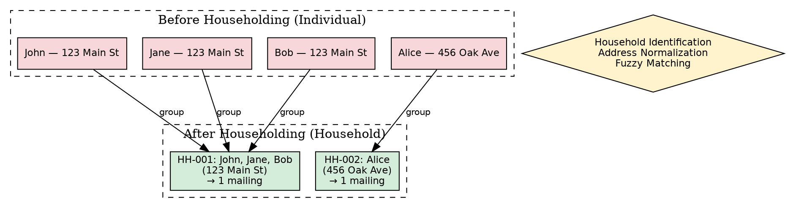
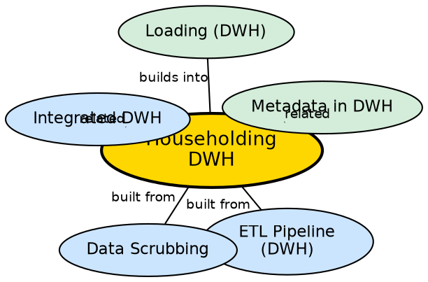

## The Problem

A company sends marketing catalogues to every customer individually, unaware that five customers live at the same address (a single household). This wastes resources — five catalogues are printed and mailed when one would suffice. For a company sending 1 million catalogues at Rs. 50 each (Rs. 50 million total), even a 2% reduction through householding saves Rs. 1 million. Without identifying households, the company wastes money on redundant communications.

## Core Idea

**Householding** is the process of identifying all members of a household (people living at the same address) and grouping them together to enable household-level decisions rather than individual-level decisions. It eliminates redundant communications, reduces marketing costs, and enables household-level analysis (e.g., "total household spending").

## How It Works

Householding operates during the ETL transformation phase:

1. **Address normalization:** Standardize addresses across all source records — consistent formatting, spelling, ZIP code validation. This is essential because "123 Main St." and "123 Main Street, Apt 4B" must be recognized as the same address.
2. **Household identification:** Group records that share the same normalized address into household clusters. Fuzzy matching handles minor variations (typos, abbreviations).
3. **Household ID assignment:** Assign a unique household identifier to all members of each cluster.
4. **Household-level aggregation:** Compute household-level metrics — total household income, combined purchase history, household size.
5. **Deduplication of communications:** When generating marketing mailings, send one per household instead of one per individual.

**Cost savings example:** 1 million catalogues at Rs. 50 each = Rs. 50 million. A 2% reduction through householding eliminates 20,000 unnecessary mailings, saving Rs. 1 million.

## Visual Explanation

## Semantic Network

## Key Properties

- **Address-based grouping:** Identifies households by matching normalized addresses
- **Cost reduction:** Eliminates redundant communications, saving significant marketing expenses
- **Household-level analysis:** Enables analysis at household granularity (total household spending, household size)
- **Fuzzy matching required:** Handles address variations, typos, and abbreviations
- **Direct financial impact:** Measurable ROI — savings can be calculated precisely

## Connections

- **Built from:** [[etl-pipeline-dwh|ETL Pipeline (DWH)]] — householding is part of the Transform phase
- **Built from:** [[data-scrubbing|Data Scrubbing]] — address normalization is a scrubbing technique
- **Related:** [[integrated-dwh|Integrated DWH]] — householding requires integration across sources
- **Builds into:** [[loading-dwh|Loading (DWH)]] — household IDs are loaded as new attributes
- **Related:** [[metadata-in-dwh|Metadata in DWH]] — householding rules and mappings stored in metadata

## Edge Cases & Gotchas

- **Multi-unit addresses:** Apartments, shared offices, and dormitories complicate household identification — same building, different households.
- **Address changes:** When a household moves, the system must recognize the new address as the same household.
- **Privacy concerns:** Grouping individuals by address may raise privacy issues, especially in regulated industries.
- **False matches:** Fuzzy matching can incorrectly group unrelated people at similar addresses (e.g., "123 Main St" vs "123 Main St NE").