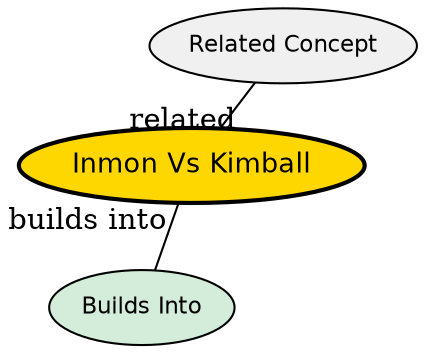

## What's Being Compared

Two competing philosophies for building data warehouses: Bill Inmon's top-down approach (enterprise warehouse first, then data marts) vs. Ralph Kimball's bottom-up approach (data marts first, then conformed dimensions). This distinction maps directly to the Dependent vs. Independent data mart types.

## The Core Tension

The fundamental disagreement is **where to start**: build the complete enterprise warehouse first (Inmon) or build department-level data marts first and integrate them later (Kimball). Inmon prioritizes data consistency; Kimball prioritizes speed to value.

## Comparison

| Dimension | [[data-mart-types|Dependent (Inmon)]] | [[data-mart-types|Independent (Kimball)]] | [[data-mart-types|Hybrid]] |
|-----------|--------------|--------------|--------------|
| Starting point | Central enterprise warehouse | Departmental data marts | Both simultaneously |
| Data flow | Sources → DWH → Data Marts | Sources → Data Marts → (DWH later) | Sources → DWH → Marts AND Sources → Marts |
| Data consistency | Guaranteed (single source of truth) | Risk of inconsistency (data silos) | Moderate (central hub + direct paths) |
| Time to value | Slow (warehouse first) | Fast (marts first) | Moderate |
| Cost | High upfront | Lower upfront, may increase during integration | Variable |
| Best for | Large organizations (MNCs) | Small organizations, startups | Organizations with mixed needs |
| Integration risk | Low (integration done first) | High (integration deferred) | Moderate |

## When to Choose Inmon (Dependent / Top-Down)

- Large organization with centralized operations
- Budget allows for upfront enterprise warehouse investment
- Data consistency is the highest priority
- Long-term analytical strategy exists

## When to Choose Kimball (Independent / Bottom-Up)

- Small organization or startup
- Limited budget, need quick wins
- Departments need analytical capability immediately
- Willing to accept integration risk for speed

## When to Choose Hybrid

- Organization has both enterprise-wide and department-specific needs
- Some departments need immediate capability while central warehouse is being built
- Flexibility is more important than architectural purity

## The Insight

The Inmon vs. Kimball debate is often framed as a binary choice, but in practice, **most successful warehouses evolve from Kimball to Inmon**. Organizations start with independent data marts (quick wins), then gradually build a central warehouse as inconsistencies become painful. The hybrid model is the most realistic path for growing companies -- it acknowledges that architectural purity must be balanced against business urgency.

## Visual Explanation

## Semantic Network

## Connections

- [[data-mart-types|Data Mart Types]] -- the three types embody these approaches
- [[dwh-server-models|DWH Server Models]] -- server architecture follows the chosen approach
- [[integrated-dwh|Integrated DWH]] -- Inmon's approach maximizes integration
- [[dwh-evolution|DWH Evolution]] -- both approaches emerged in the 1990s OLAP era
- [[three-tier-dwh-architecture|Three-Tier DWH Architecture]] -- both approaches implement the three tiers differently
- [[oltp-vs-olap|OLTP vs OLAP]] -- both approaches serve the OLAP side of the split