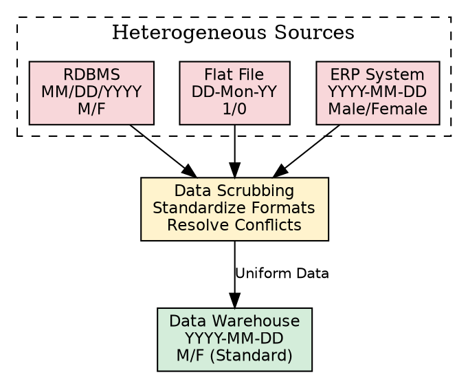
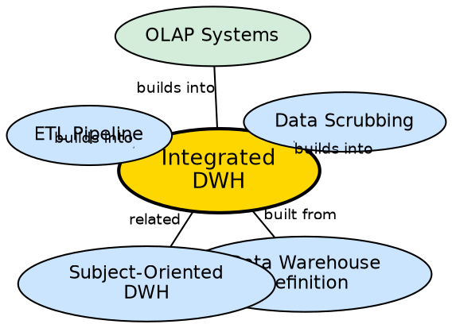

## The Problem

Every operational system in a company stores data differently. One database uses "MM/DD/YYYY" for dates, another uses "DD-Mon-YY." Gender might be stored as "M/F" in one system, "1/0" in another, and "Male/Female" in a third. Customer names have different spellings across systems. Without integration, analysts cannot reliably combine data from different sources — they get conflicting results depending on which system they query.

## Core Idea

An **integrated** data warehouse resolves format inconsistencies across heterogeneous data sources by converting all incoming data into a single, uniform structure before loading. This involves standardizing date formats, encoding conventions, naming patterns, units of measure, and attribute names so that data from any source can be queried and compared seamlessly.

## How It Works

The integration process occurs during the ETL pipeline's transformation phase:

1. **Extract from heterogeneous sources:** Pull data from relational databases, flat files, ERP systems, legacy systems, and external APIs. Data is captured in its "as is" state.
2. **Data scrubbing (format standardization):**
   - Encode free-form values: "Male", "M", "1", "male" → standard "M"
   - Map different units: centimeters, inches, yards → single standard unit
   - Map different attribute names: "bal", "currbal", "balcurr" → "balance"
   - Resolve name variations: "Agrawal", "Agarwal", "Aggarwal" → canonical spelling
3. **Conditioning:** Convert source data types to target warehouse data types (e.g., string to integer, VARCHAR to DATE).
4. **Entity resolution:** Map different account numbers or IDs generated by different applications for the same customer to a single identification number.
5. **Enrichment:** Augment operational data with external sources (e.g., adding demographic survey data to customer records).

The result is a warehouse where a query for "total sales in Q1" returns the same number regardless of which source systems contributed the underlying data.

## Visual Explanation

## Semantic Network

## Key Properties

- **Format harmonization:** All dates, codes, units, and encodings standardized to a single convention
- **Cross-source queryability:** Data from any source can be joined and compared without manual reconciliation
- **Entity resolution:** Same real-world entity identified uniquely across all sources
- **Metadata-driven:** Integration rules (mappings, transformations) are documented in metadata
- **Ongoing process:** New sources require new integration rules; integration is never "done"

## Connections

- **Built from:** [[data-warehouse-definition|Data Warehouse Definition]] — second of Inmon's four characteristics
- **Built from:** [[subject-oriented-dwh|Subject-Oriented]] — subject consolidation requires integration
- **Builds into:** [[etl-pipeline-dwh|ETL Pipeline (DWH)]] — integration happens in the ETL transform phase
- **Builds into:** [[data-scrubbing|Data Scrubbing]] — the specific mechanism for resolving format conflicts
- **Related:** [[metadata-in-dwh|Metadata in DWH]] — integration rules and mappings stored as metadata
- **Related:** [[dwh-refresh|DWH Refresh]] — integration must be reapplied during each refresh cycle

## Edge Cases & Gotchas

- **Integration is not deduplication:** Standardizing "M" and "Male" to "M" is integration; realizing two records are the same person is deduplication. Both are needed but are different processes.
- **Loss of source fidelity:** Once integrated, the original source format is lost unless explicitly preserved in metadata.
- **Conflicting business rules:** Two source systems may apply different business rules (e.g., different revenue recognition policies). Integration must decide which rule "wins."