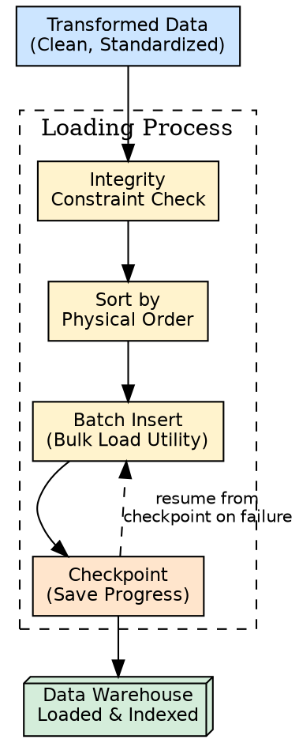
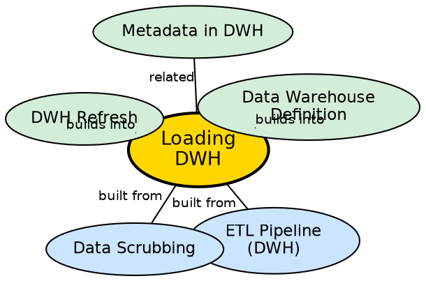

## The Problem

After data has been extracted, cleaned, and transformed, it must be inserted into the warehouse. But the volumes are massive — millions or billions of records. A naive row-by-row INSERT approach would take days. Furthermore, if the load fails halfway through (network issue, disk full, power outage), the warehouse would be left in an inconsistent state with partial data.

## Core Idea

**Loading** is the third phase of the ETL pipeline. It inserts cleaned and transformed data into the warehouse using **batch load utilities** optimized for high-volume insertion. The load process includes integrity constraint checking, sorting, summarizing, and **checkpoint support** so that failed loads can resume from the last saved point without losing data integrity.

## How It Works

The loading process involves several critical steps:

1. **Integrity constraint checking:** Before inserting, the load utility verifies that data satisfies all constraints — primary keys are unique, foreign keys reference valid records, NOT NULL columns have values, data types match.
2. **Sorting:** Data is sorted to match the warehouse's physical storage order (e.g., by date, by region). Sorted data improves query performance and enables efficient indexing.
3. **Summarizing:** Aggregate values (totals, averages, counts) are pre-computed during loading to speed up common analytical queries.
4. **Batch insertion:** Records are inserted in large batches (not row-by-row) using bulk load utilities provided by the DBMS. This is orders of magnitude faster than individual INSERT statements.
5. **Checkpoint management:** The load is divided into segments. After each segment, a checkpoint is recorded. If the load fails, it restarts from the last checkpoint — not from the beginning.
6. **Admin controls:** The load utility allows administrators to monitor status, cancel, suspend, resume, and restart after failure.

**Key issues in loading:**
- **Volume:** Load utilities must handle terabytes of data efficiently.
- **Sequential load time:** Loading data sequentially can take very long — parallel loading strategies are often needed.
- **Full load as transaction:** A full load is treated as a single long batch transaction; checkpoints ensure recoverability.

## Visual Explanation

## Semantic Network

## Key Properties

- **Batch-oriented:** Bulk load utilities insert millions of records at once, not row-by-row
- **Checkpoint support:** Failed loads resume from last checkpoint, not from scratch
- **Integrity enforcement:** All constraints (PK, FK, NOT NULL) are validated during load
- **Sorted insertion:** Data sorted to match physical storage order for optimal query performance
- **Admin controls:** Monitor, cancel, suspend, resume — full operational control

## Connections

- **Built from:** [[etl-pipeline-dwh|ETL Pipeline (DWH)]] — loading is the third phase
- **Built from:** [[data-scrubbing|Data Scrubbing]] — only cleaned data enters the loading phase
- **Builds into:** [[dwh-refresh|DWH Refresh]] — loading is the initial load; refresh maintains it
- **Builds into:** [[data-warehouse-definition|Data Warehouse Definition]] — loading populates the warehouse
- **Related:** [[metadata-in-dwh|Metadata in DWH]] — load status and history tracked in metadata

## Edge Cases & Gotchas

- **Partial load corruption:** Without checkpoints, a failed load leaves the warehouse in an inconsistent state. Always use checkpointing.
- **Foreign key violations:** If dimension tables are not loaded before fact tables, FK constraints will fail. Load order matters.
- **Index rebuild cost:** After bulk loading, indexes must be rebuilt — this can take as long as the load itself.
- **Disk space:** Batch loading requires temporary space for sorting and staging. Insufficient disk space causes load failure.

## Sources

- [[dw1-summary|Source: Data Warehouse — Definitions, Architecture, ETL, OLAP]] — loading phase, checkpoint mechanism, load issues
