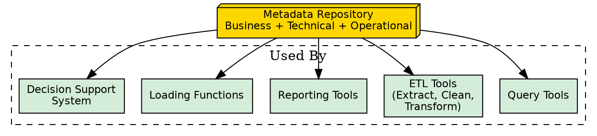
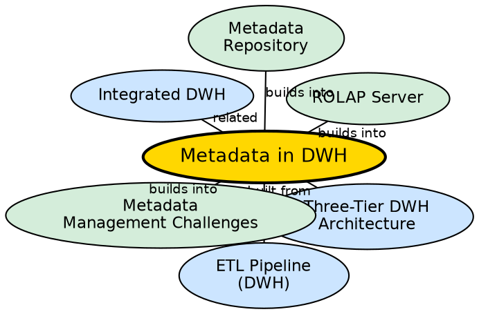

## The Problem

A data warehouse contains petabytes of data from hundreds of sources. Without documentation describing what each table means, where the data came from, how it was transformed, and what business terms represent, the warehouse is a useless data swamp. Analysts cannot find what they need, and reports cannot be trusted without understanding the data's origin and transformation history.

## Core Idea

**Metadata** is "data about data" — the roadmap, directory, and documentation of the data warehouse. It defines all warehouse objects, tracks data lineage (history of migrations and transformations), records data currency (active, archived, or purged), and maps business terms to technical structures. Without metadata, a data warehouse is an unreadable mountain of bytes.

## How It Works

### Three Categories of Metadata

1. **Business Metadata:**
   - Business terms and definitions (e.g., "Revenue = gross sales minus returns").
   - Data ownership information (who is responsible for each data domain).
   - Changing policies (how business definitions evolve over time).
   - Non-technical — designed for business end-users.

2. **Technical Metadata:**
   - Database system names, table and column names and sizes.
   - Data types and allowed values.
   - Structural information: primary keys, foreign keys, indices.
   - Warehouse schema, views, dimensions, hierarchies, derived data definitions.
   - Technical — designed for developers and DBAs.

3. **Operational Metadata:**
   - **Data lineage:** History of migrated data and the sequence of transformations applied.
   - **Data currency:** Whether data is active, archived, or purged.
   - Monitoring information: warehouse usage statistics, error reports, audit trails.
   - Data refresh and purging rules, security (user authorization and access control).

### What a Metadata Repository Contains

- **Structure description:** Schema, views, dimensions, hierarchies, data mart locations.
- **Operational history:** Migration history, transformation sequences, monitoring data.
- **Summarization algorithms:** Measure and dimension definitions, granularity, partitions, aggregation rules.
- **Source-to-warehouse mapping:** Source databases, gateway descriptions, extraction rules, cleaning rules, transformation rules.
- **Performance data:** Indices, profiles, timing and scheduling rules for refresh/update/replication cycles.

### Roles of Metadata

Metadata is used by: query tools, extraction and cleansing tools, reporting tools, transformation tools, loading functions, and the decision support system for data mapping.

## Visual Explanation

## Semantic Network

## Key Properties

- **Three categories:** Business, Technical, Operational — each serves different users
- **Roadmap function:** Acts as a directory helping users find and understand warehouse contents
- **Transformation tracking:** Records every step data takes from source to warehouse
- **Used everywhere:** Query tools, ETL, reporting, loading, and DSS all depend on metadata
- **Repository-based:** All metadata is stored in a centralized metadata repository

## Connections

- **Built from:** [[three-tier-dwh-architecture|Three-Tier DWH Architecture]] — metadata is part of Tier 1
- **Built from:** [[etl-pipeline-dwh|ETL Pipeline (DWH)]] — metadata tracks transformation rules
- **Related:** [[integrated-dwh|Integrated DWH]] — integration rules are stored as metadata
- **Builds into:** [[rolap-server|ROLAP Server]] — ROLAP depends on metadata for dimension mapping
- **Builds into:** [[metadata-repository|Metadata Repository]] — the repository stores all metadata categories
- **Builds into:** [[metadata-management-challenges|Metadata Management Challenges]] — challenges of managing metadata at scale

## Edge Cases & Gotchas

- **Scattered metadata:** In large organizations, metadata exists in spreadsheets, databases, applications, text files, and multimedia — consolidating it is a major challenge.
- **No industry standards:** There are no widely accepted standards for metadata management, making vendor interoperability difficult.
- **Metadata staleness:** If metadata is not updated when the warehouse changes, it becomes actively misleading.
- **Business vs. Technical gap:** Business users need business metadata; developers need technical metadata. Bridging the gap requires deliberate effort.