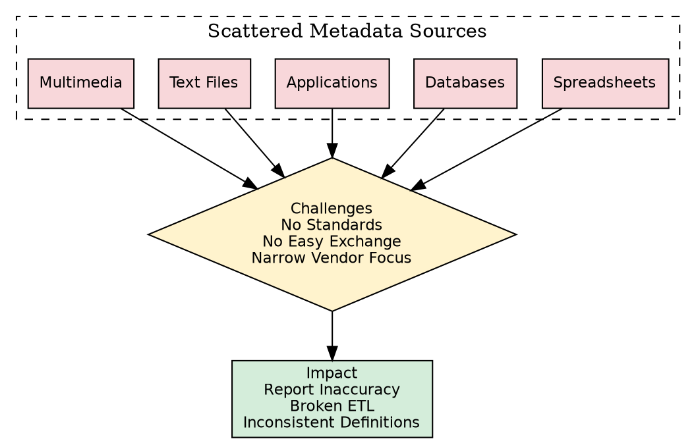
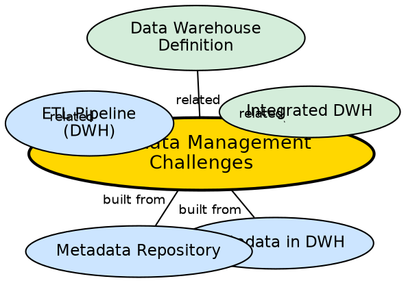

## The Problem

Metadata drives report accuracy, validates data transformations, enforces business term definitions, and ensures calculation correctness. Despite its importance, managing metadata at enterprise scale is fraught with difficulties. Metadata is scattered across formats and systems, there are no industry-wide standards for passing it between tools, and vendors focus narrowly on their own products.

## Core Idea

**Metadata management challenges** are the organizational and technical difficulties in maintaining accurate, accessible, and standardized metadata across a large enterprise. These challenges include scattered metadata across diverse formats and systems, lack of industry standards, no easy methods for passing metadata between tools, and narrow vendor focus.

## How It Works

The challenges manifest in four key areas:

1. **Scattered Metadata:**
   - Metadata exists in spreadsheets, databases, applications, text files, and multimedia files across the organization.
   - Each department or system maintains its own metadata independently.
   - No centralized view of what metadata exists or where it is located.
   - Consolidating scattered metadata requires significant effort and coordination.

2. **Format Diversity:**
   - Metadata in text files or multimedia files requires special handling to be usable by information management solutions.
   - Structured metadata (database catalogs) and unstructured metadata (document descriptions) must be reconciled.
   - Converting metadata from diverse formats to a unified structure is non-trivial.

3. **No Industry-Wide Standards:**
   - Data management solution vendors have narrow focus areas — each defines metadata differently.
   - No universally accepted metadata interchange format or protocol.
   - Tool interoperability is limited — metadata from one tool often cannot be imported into another.

4. **No Easy Methods of Passing Metadata:**
   - Transferring metadata between systems (e.g., from ETL tool to reporting tool) requires custom integration.
   - Metadata changes in one system must be manually propagated to others.
   - No standardized API for metadata exchange.

### Why These Challenges Matter

Metadata ensures:
- **Report accuracy:** Reports are only as good as the metadata defining their sources and calculations.
- **Transformation validation:** ETL processes depend on metadata to know how to transform data.
- **Business term consistency:** All users must agree on what "revenue" or "customer" means.

## Visual Explanation

## Semantic Network

## Key Properties

- **Four challenge areas:** Scattered metadata, format diversity, no standards, no easy exchange
- **Enterprise-wide problem:** Affects all departments and systems
- **Vendor ecosystem issue:** Narrow vendor focus prevents interoperability
- **Impact on accuracy:** Poor metadata management leads to inaccurate reports and broken ETL
- **No silver bullet:** No industry-wide solution exists

## Connections

- **Built from:** [[metadata-in-dwh|Metadata in DWH]] — challenges arise from metadata's importance
- **Built from:** [[metadata-repository|Metadata Repository]] — the repository must address these challenges
- **Related:** [[etl-pipeline-dwh|ETL Pipeline (DWH)]] — ETL depends on accurate metadata
- **Related:** [[integrated-dwh|Integrated DWH]] — integration requires consistent metadata across sources
- **Related:** [[data-warehouse-definition|Data Warehouse Definition]] — the warehouse's value depends on metadata quality

## Edge Cases & Gotchas

- **Metadata governance is essential:** Without a designated metadata governance team, metadata quality degrades over time.
- **Tool consolidation helps:** Using fewer vendors reduces metadata interoperability challenges.
- **Metadata quality initiatives:** Some organizations implement metadata quality audits similar to data quality audits.
- **Emerging standards:** While no universal standard exists, initiatives like the OMG's Common Warehouse Metamodel (CWM) attempt to address interoperability.

## Sources

- [[dw1-summary|Source: Data Warehouse — Definitions, Architecture, ETL, OLAP]] — metadata management challenges
