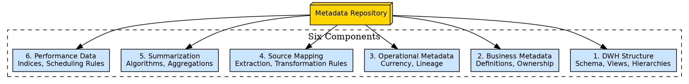
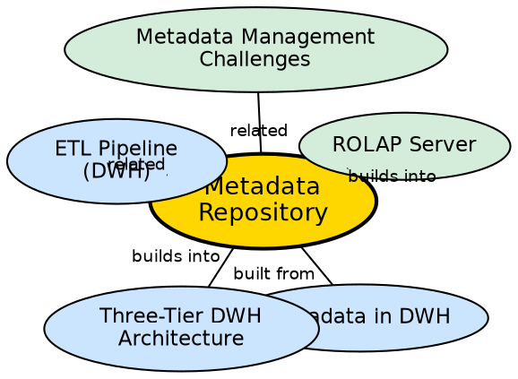

## The Problem

Metadata — the documentation describing what warehouse data means, where it came from, and how it was transformed — must be stored somewhere accessible to all tools and users that depend on it. If metadata is scattered across spreadsheets, code comments, and individual team members' knowledge, it becomes unusable and unreliable.

## Core Idea

A **metadata repository** is the centralized storage system that is an integral part of the data warehouse. It contains six key types of metadata: warehouse structure definitions, business metadata, operational metadata, source-to-warehouse mapping rules, summarization algorithms, and performance data. It serves as the single authoritative source for all warehouse documentation.

## How It Works

The metadata repository organizes metadata into six components:

1. **Definition of Data Warehouse:**
   - Schema description, views, dimension hierarchies, derived data definitions.
   - Data mart locations and their contents.

2. **Business Metadata:**
   - Data ownership information, business term definitions, changing policies.

3. **Operational Metadata:**
   - Data currency (active, archived, or purged).
   - Data lineage (history of migrations and transformations applied).

4. **Mapping from Operational Environment:**
   - Source databases and their contents.
   - Data extraction, cleaning, and transformation rules and defaults.
   - Data refresh and purging rules.
   - Security: user authorization and access control.

5. **Algorithms for Summarization:**
   - Dimension algorithms, data granularity definitions.
   - Aggregation and summarization rules.
   - Predefined queries and reports.

6. **Performance Data:**
   - Indices and profiles that improve data access and retrieval.
   - Rules for timing and scheduling of refresh, update, and replication cycles.

## Visual Explanation

## Semantic Network

## Key Properties

- **Six components:** Structure, business, operational, mapping, summarization, performance
- **Centralized:** Single authoritative source for all warehouse metadata
- **Tool-agnostic:** Serves query tools, ETL, reporting, loading, and DSS
- **Integrally linked:** The repository is part of the warehouse system, not external to it
- **Comprehensive:** Covers technical, business, and operational dimensions

## Connections

- **Built from:** [[metadata-in-dwh|Metadata in DWH]] — the repository stores all metadata categories
- **Built from:** [[three-tier-dwh-architecture|Three-Tier DWH Architecture]] — repository resides in Tier 1
- **Builds into:** [[rolap-server|ROLAP Server]] — ROLAP queries the repository for dimension mappings
- **Related:** [[etl-pipeline-dwh|ETL Pipeline (DWH)]] — ETL rules and transformation logic stored in repository
- **Related:** [[metadata-management-challenges|Metadata Management Challenges]] — challenges of maintaining the repository

## Edge Cases & Gotchas

- **Repository becomes stale:** If the warehouse schema changes and the repository is not updated, tools relying on it will break.
- **Access control:** The repository itself needs security — not all users should see all metadata (e.g., ETL transformation rules may be sensitive).
- **Versioning:** When transformation rules change, the repository should track both old and new versions for audit purposes.

## Sources

- [[dw1-summary|Source: Data Warehouse — Definitions, Architecture, ETL, OLAP]] — metadata repository components
