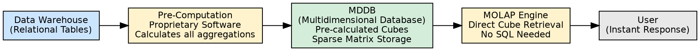
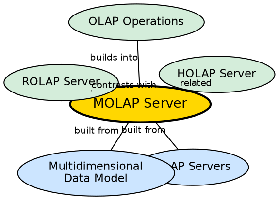

## The Problem

When analysts need to interactively explore data across multiple dimensions — slicing, dicing, rolling up, drilling down — dynamically generating SQL queries (as ROLAP does) introduces unacceptable latency. Every user action requires the database to compute aggregations on-the-fly, which can take seconds or minutes for large datasets.

## Core Idea

**MOLAP (Multidimensional Online Analytical Processing)** stores data in proprietary **multidimensional databases (MDDBs)** as pre-calculated arrays of data cubes. Because the cubes are computed during the data load phase (not at query time), user requests are served with near-instant response — no SQL generation or computation is needed at query time.

## How It Works

1. **Data loading phase (pre-computation):** When data is loaded from the warehouse into the MDDB, proprietary software pre-calculates all possible aggregations and stores them in multidimensional arrays (data cubes).
2. **Storage format:** Data is stored in specialized multidimensional arrays, not relational tables. Each cell in the array corresponds to a specific combination of dimension values.
3. **Sparse matrix technology:** Since most cells in a high-dimensional cube are empty (no sales for a specific product in a specific city on a specific day), MOLAP uses sparse matrix techniques to efficiently store only non-empty cells.
4. **Query phase:** When a user requests data, the MOLAP engine directly retrieves pre-calculated values from the MDDB — no SQL, no joins, no aggregations.
5. **Application layer:** The MOLAP engine resides in the application layer, providing a simple interface for users of all skill levels.

**Strengths:**
- Lightning-fast response time (data already pre-calculated)
- Simple interface compatible with both experienced and inexperienced users
- Fast indexing to previously summarized data

**Weaknesses:**
- Limited data volumes — cannot store detailed transactional data
- Storage waste with sparse (scattered) datasets despite sparse matrix optimization
- Proprietary format — vendor lock-in risk
- Not suitable for users who need detailed, row-level data

## Visual Explanation

## Semantic Network

## Key Properties

- **Pre-calculated cubes:** All aggregations computed during load, not at query time
- **MDDB storage:** Proprietary multidimensional arrays, not relational tables
- **Sparse matrix technology:** Efficiently stores mostly-empty cubes
- **Instant response:** No SQL generation or computation at query time
- **Limited detail:** Stores summaries, not detailed transactional data

## Connections

- **Built from:** [[olap-servers|OLAP Servers]] — MOLAP is one of four server types
- **Built from:** [[multidimensional-data-model|Multidimensional Data Model]] — MOLAP implements the model directly
- **Contrasts with:** [[rolap-server|ROLAP Server]] — MOLAP pre-computes; ROLAP computes dynamically
- **Related:** [[holap-server|HOLAP Server]] — HOLAP combines MOLAP aggregations with ROLAP detail
- **Builds into:** [[olap-operations|OLAP Operations]] — MOLAP serves pre-computed results for all operations
- **Related:** [[dwh-scale|Data Warehouse Scale]] — MOLAP is limited by storage costs for large datasets

## Edge Cases & Gotchas

- **Storage explosion:** Pre-computing all possible aggregations for many dimensions creates enormous storage requirements.
- **Refresh latency:** When warehouse data is refreshed, MOLAP cubes must be re-computed — this can take hours.
- **Vendor lock-in:** MDDB formats are proprietary — migrating data between MOLAP vendors requires re-extraction and re-computation.
- **No detailed data:** MOLAP cannot answer "show me all individual transactions" — it only stores aggregated data.

## Sources

- [[dw1-summary|Source: Data Warehouse — Definitions, Architecture, ETL, OLAP]] — MOLAP definition, MDDB, sparse matrix, advantages, disadvantages
