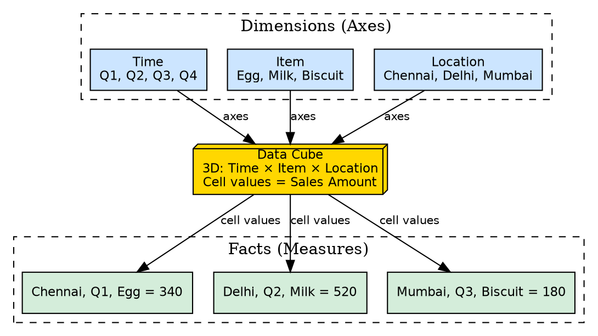
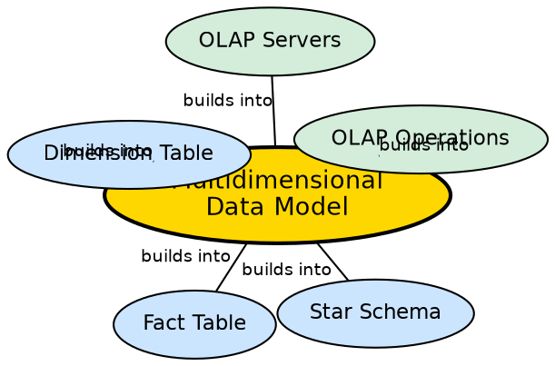

## The Problem

In a flat relational table, data is organized in rows and columns — a 2D structure. When a manager asks "What were the sales of Biscuits in Chennai during Q3?", the query must filter across three attributes simultaneously. As the number of analysis dimensions increases, flat tables require increasingly complex GROUP BY and JOIN operations that become slow and hard to understand.

## Core Idea

The **multidimensional data model** organizes data around a central theme (represented by a **fact table**) with multiple **dimensions** (entities the business tracks, like Time, Item, Location). Data is stored in the form of a **data cube**, where each cell at the intersection of dimension values contains a **numerical measure** (fact). This enables intuitive, multi-angle analysis of business data.

## How It Works

The model has two fundamental building blocks:

1. **Dimensions:** Business entities along which analysis is performed — Time (Q1, Q2, Q3, Q4), Item (Egg, Milk, Biscuit), Location (Chennai, Delhi, Mumbai). Each dimension has a related dimension table describing its attributes.

2. **Facts (Measures):** Numerical values at the intersection of dimensions — e.g., 340 units of Eggs sold in Chennai in Q1. The fact table contains these measures along with foreign keys to each dimension.

**From Flat to Cube:**
- A flat fact relation: `(p1, c1, 12)` — product 1, client 1, amount 12
- A 2D cube (matrix): rows = Product, columns = Client, cell values = Amount
- A 3D cube: add Date as a third dimension — each date gets its own 2D matrix, stacked to form a cube

**SQL Mapping:**
- `SELECT sum(Amt) FROM SALE WHERE Date = 1` corresponds to taking one 2D slice of the 3D cube (Day 1) and summing all values.
- Each WHERE clause selects a slice; each GROUP BY rolls up along a dimension.

## Visual Explanation

## Semantic Network

## Key Properties

- **Two building blocks:** Facts (numerical measures) and Dimensions (analysis axes)
- **Data cube representation:** Data arranged in N-dimensional space (typically 2D or 3D)
- **Central theme:** All dimensions relate to a single business process (e.g., sales)
- **SQL mapping:** WHERE = slice, GROUP BY = roll-up, SUM/AVG = aggregation
- **Beyond 3D:** Hypercubes (4D, 5D) exist logically but are hard to visualize

## Connections

- **Built from:** [[wiki/data-warehouse/star-schema|Star Schema]] — the relational implementation of the multidimensional model
- **Builds into:** [[wiki/data-warehouse/fact-table|Fact Table]] — facts are the measures in the cube
- **Builds into:** [[wiki/data-warehouse/dimension-table|Dimension Table]] — dimensions are the axes of the cube
- **Builds into:** [[olap-operations|OLAP Operations]] — operations manipulate the cube (slice, dice, roll-up, drill-down)
- **Builds into:** [[olap-servers|OLAP Servers]] — servers implement the multidimensional model
- **Related:** [[dwh-scale|Data Warehouse Scale]] — cube size grows with dimension cardinality

## Edge Cases & Gotchas

- **Data sparsity:** Most cells in a high-dimensional cube are empty (null). A city may not sell a particular product on a particular day. This wastes storage.
- **Dimension explosion:** Adding more dimensions exponentially increases the number of cells. A cube with 5 dimensions of cardinality 100 each has 10 billion cells.
- **Visualization limit:** Humans can visualize up to 3 dimensions easily. Beyond that, the model is mathematical but not intuitive.
- **Cube vs. table:** The multidimensional model is a conceptual model; it is implemented using star/snowflake schemas in relational databases.