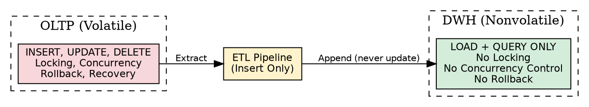
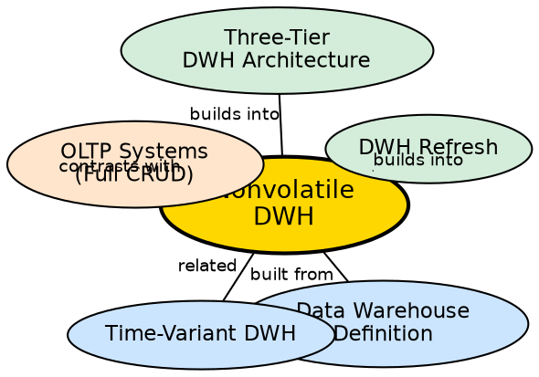

## The Problem

In an operational database, multiple users simultaneously insert, update, and delete records. This requires complex concurrency control (locking, deadlocks), transaction management (ACID properties, rollback), and recovery mechanisms (WAL logs, checkpoints). When analytical queries scan millions of rows, they lock tables and slow down live transactions. Running analysis on the same database that handles daily operations creates resource contention and performance degradation for both workloads.

## Core Idea

A **nonvolatile** data warehouse is a physically separate store of data where, once data is loaded, it is **never updated or deleted**. The only two operations permitted are **initial loading** (and periodic refresh) and **querying (read access)**. This fundamental design eliminates the need for transaction processing, concurrency control, and recovery mechanisms, allowing the warehouse to focus entirely on optimizing read performance.

## How It Works

Nonvolatility is enforced at multiple levels:

1. **Physical separation:** The warehouse runs on separate hardware/infrastructure from operational systems. There is no shared database, no shared locks.
2. **Insert-and-read only:** Data enters the warehouse through the ETL pipeline. Once loaded, it is never modified in place. If a source record changes, the warehouse appends a new version with a new timestamp rather than updating the old record.
3. **No transaction processing:** Since there are no concurrent writes, the warehouse does not need locking, deadlock detection, or rollback mechanisms. This simplifies the architecture significantly.
4. **No concurrency control:** Read-only access means multiple users can query simultaneously without conflict. No row-level or table-level locks are needed.
5. **Periodic refresh instead of real-time updates:** Changes from source systems are propagated to the warehouse on a scheduled basis (nightly, weekly) through the ETL refresh process. The warehouse is a snapshot in time, not a live mirror.

The tradeoff is clear: you lose real-time accuracy but gain massive analytical performance and architectural simplicity.

## Visual Explanation

## Semantic Network

## Key Properties

- **Read-only after load:** No UPDATE or DELETE operations on warehouse data
- **Physical separation:** Separate infrastructure from operational systems
- **No concurrency control:** Multiple simultaneous reads without locking
- **No transaction overhead:** No ACID requirements, no rollback, no recovery mechanisms
- **Append-based growth:** New data is appended; historical data is preserved
- **Periodic refresh:** Updates come through scheduled ETL cycles, not real-time

## Connections

- **Built from:** [[data-warehouse-definition|Data Warehouse Definition]] — fourth of Inmon's four characteristics
- **Built from:** [[time-variant-dwh|Time-Variant]] — nonvolatility preserves the historical record
- **Contrasts with:** [[oltp-vs-olap|OLTP vs OLAP]] — OLTP requires full CRUD + concurrency control; OLAP is read-only
- **Builds into:** [[dwh-refresh|DWH Refresh]] — the only mechanism for updating warehouse data
- **Builds into:** [[three-tier-dwh-architecture|Three-Tier DWH Architecture]] — nonvolatility is enforced at the bottom tier
- **Related:** [[etl-pipeline-dwh|ETL Pipeline (DWH)]] — ETL is the sole mechanism for data entry

## Edge Cases & Gotchas

- **Nonvolatile ≠ static:** Data is refreshed periodically. "Nonvolatile" means no in-place updates, not that data never changes.
- **Correcting errors is hard:** If bad data was loaded, you cannot simply UPDATE it. You must either append a corrected record or reload the entire batch.
- **Storage cost:** Since data is never deleted, the warehouse grows indefinitely. Archival policies (moving old data to cheaper storage) are essential.
- **Not suitable for operational queries:** By design, the warehouse cannot answer "what is the current state?" questions — only "what was the state at time X?"

## Sources

- [[dw1-summary|Source: Data Warehouse — Definitions, Architecture, ETL, OLAP]] — nonvolatile characteristic, separation from operational environment
